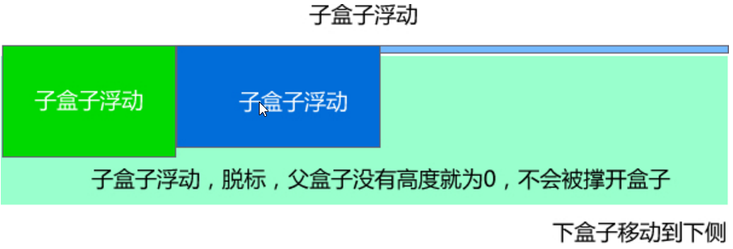

#	   CSS学习笔记

[TOC]

##	  行高
一个标签(盒子)的高度由三部分组成：上距离、内容高度和下距离
***
***
##  css样式的三大特性
###	重叠性

指的是流浪器处理冲突的能力，相同优先级的条件下，同一个属性被多次设置到一个元素上，这个时候一个属性会将里一个属性重叠掉

**重叠遵循就近原则：** 下面的重叠掉上去的，也就是距离结构越近的重叠掉远的

**口诀：** 长江后浪推前浪，前浪死在沙滩上
###	继承性

子标签会继承父标签的<font style = "color:red">**某些**</font>样式,example:文本颜色和字号

**总结：** 子承父业，一般是文本相关的一些样式
###	优先级
不同的css选择器有不同的优先级别，具体规范如下：

优先级用一个四位数的数 字串(css@2是三位)来表示，像四个级别，值从左往右，左面的最大，一级大于一级，数位之间没有进制，一别之间不可超越。

| 描述 | 权重值 |
| ---------------- |:---------:|
|**继承或者*的贡献值**|**0,0,0,0**|
|每个元素(标签选择器)贡献值|0,0,0,1|
|每个类，伪类(类选择器)贡献值|0,0,1,0|
|每个ID(ID选择器)贡献值|0,1,0,0|
|每个内行样式贡献值|1,0,0,0|
|每个!important贡献值|∞ 无穷大|

*tips：* 位数之间不存在进位，就是说最后一位最后相互累加超过10(0,0,0,10)时，不会变成0,0,1,0，而是依然是0,0,0,10
例如：
```css
div ul li             -------------> 0,0,0,3
.nav ul li            -------------> 0,0,1,2
a:hover               -------------> 0,0,1,1(a标签的悬停伪类选择)
.nav a                -------------> 0,0,1,1
#nav div              -------------> 0,1,0,1
div ul li a ..15个... -------------> 0,0,0,15(而不是0,0,1,5)
```

```css

```
##  浮动(float)
浮动的作用是让标签逃离标准流控制从而使多个块标签在同一行显示，相对于行内块标签的优势是相邻标签之间可以无缝衔接

使用方式：`选择器{float:属性值;}`

| 属性值 | 描述 |
| ------------- |:-------------:|
| left | 元素向左浮动 |
| right | 元素向右浮动 |
| none | 不浮动(默认值) |
***
**浮动内幕特性**

1.  脱离标准流，不占位置从而影响<font style = "color:red;font-weight:bold">**后面**</font>标准流；表现：浮动下方标准流块标签会重叠在浮动标签下层
    ，但是浮动标签上面或前面的标准流块标签不影响
2.  浮动只有左右浮动，不会上下浮动(上下只会重叠)；
3.  浮动不会越过父标签的内边距(padding)；表现：只会在父标签的内边距内部左右浮动
4.  浮动具有隐藏的显示模式转换，加了浮动元素具有行内块元素的特性(但不是行内块元素)，元素的大小完全取决于定义的大小或者内容的大小
***

###  清除浮动
本质不是清楚浮动本身，是清除浮动的影响。

-  **为什么要清除浮动**
    1.  有时候父盒子不方便给高度，比如：文章需要浮动的时候。
    2.  如果子盒子之间是浮动，但是父盒子又没有指定高度的时候，父盒子则会你没有高度，那么父盒子下面的盒子就会顶上去和浮动的子盒子重合
    ```css
    <!DOCTYPE html>
    <html lang="en">
    <head>
        <meta charset="UTF-8">
        <title>浮动问题</title>
        <style>
            .father {
                width: 200px;
                border: 2px solid red;
            }

            .big {
                width: 100px;
                height: 120px;
                background-color: purple;
                float: left;
            }

            .small {
                width: 50px;
                height: 80px;
                background-color: black;
                float: left;
            }
            .bottom {
                width: 300px;
                height: 50px;
                background-color:forestgreen;
            }
        </style>
    </head>
    <body>
    <div class="father">
        <div class="big"></div>
        <div class="small"></div>
    </div>
    <div class="bottom"></div>
    </body>
    </html>
    ```
    效果如下：

    

    以上问题的原因是：在标准流中，盒子是占位置，所以big和small盒子会把father盒子撑开，但是子盒子浮动了就不占位置，因此father盒子就不会撑开，就是默认的大小

    

    
-   **清除浮动的本质**

清除浮动主要是为了解决父级元素因为子级浮动又不方便固定高度而引起内部高度为0的问题

-   **清除浮动的方法**

其本质叫做闭合浮动，清除浮动就是浮动的盒子圈到里面，让父盒子闭合出口和入口不让他们出来影响其他元素。
clear属性用于清除浮动，其用法如下：

选择器`{clear:属性值;}`

| 属性值 | 描述 |
| ------------- |:-------------:|
| left | 不允许左侧有浮动元素(清除左侧浮动的影响) |
| right | 不允许右侧有浮动元素(清除右侧浮动的影响)|
| both | 同时清除左右侧浮动的影响 |

1.  **额外标签法**

通过最末尾的浮动元素添加一个空的标签，例如`<div style = "clear:both"></div>`,或者其他标签即可

**优点：** 通俗易懂，书写方便

**缺点：** 添加许多无意义的标签，结构化差。

2.  **父级添加overflow属性方法**

可以通过触发**BFC**的方式实现浮动

```
可以给父级标签添加：overfload为 hidden | auto | sroll 都可以实现
```
**优点：** 代码简洁

**缺点：** 内容增多时候容易造成不会自动换行导致内容被隐藏掉，无法显示需要溢出的元素。

3.  **使用after伪元素**

:after 方式为空元素的升级版，好处是不用单独添加标签了

使用方法(为了兼容性，全写上)：
```
.clearfix:after {content: "";display:block;height:0;clear:both;visibility:hidden;}
.clearfix{*zoom:1;} /*IE6、7 专有*/
```
**优点：** 符合闭合浮动思想 结构语义化正确

**缺点：** 由于IE6-7不支持:after，使用zoom:1触发hasLayout。

代表网站：百度、淘宝网、网易等

4.  **双伪元素清除浮动**

使用before和after双伪元素清除浮动

使用方法：
```css
.clearfix:before,.clearfix:after {
    content:"";
    display:table; /* 这句话可以触发BFC BFC可以清除浮动*/
}
.clearfix:after {
    clear:both;
}
.clearfix {
    *zoom:1; /*IE6-7专用，前面带*告诉IE7以下浏览器解析，其他浏览器不解析*/
}
```
**优点：** 代码更简洁

**缺点：** 由于IE6-7不支持:after，使用zoom:1触发hasLayout。

---

---

##  定位（position）

###   元素的定位
元素的定位属性主要包括**定位模式**和**边偏移**两部分。

1.  **边偏移**

|边偏移属性|描述|
|----|:---:|
|  top  | 顶端偏移量，定义元素相对于其父元素上边线的距离 |
| bottom | 底部偏移量，定义元素相对于其父元素下边线的距离 |
| left | 左侧偏移量，定义元素相对于其父元素左边线的距离 |
| right | 右侧偏移量，定义元素相对于其父元素右边线的距离 |

就是说定位要和边偏移搭配使用

2.  **定位模式(定位的分类)**

在css中，position属性用于定义元素的定位模式，其语法如下：

```
选择器{position:属性值;}
```
position属性的常用值

|属性值|描述|
|----|:---:|
| static | 自动定位(默认定位模式) |
| relative | 相对定位，相对于其原文档流的位置进行定位 |
| absolute | 绝对定位，相对于其上一个已经定位的父元素进行定位 |
| fixed | 固定定位，相对于浏览器窗口进行定位 |
---

 ###    静态定位static

静态定位是所有元素的默认定位方式。

**静态定位唯一的用处：** 就是取消其他定位模式(position 没有none值)

---

### 相对定位relative(自恋型)
**特点：**

1.  相对定位可以通过边偏移移动位置，但是原来所占的位置，继续占用。这点和浮动很不一样
2.  每次移动的位置是以自己的左上角为基点移动(相对于自己原来位置)，以自己为中心故叫自恋型

**目的：** 在不影响其他盒子的情况，将某个盒子移动到自己想要去的位置上

---

### 绝对定位absolute(拼爹型)
**特点：**

1.  绝对定位是不占原有位置的，和*相对定位不同*
2.  若父元素**没有**定位，以浏览器屏幕为基准点移动定位(跟父元素没有位置关系)
3.  若父元素**有**定位，以最近有定位的父元素为基准点移动定位

**口诀：** 子绝父相

_意思是：_ 一般是子元素用绝对定位父元素用相对定位，这两种定位搭配使用最多

**总结：** 定位，定在哪里？留不留位置？

---

### 定位的盒子水平/垂直居中
问题：加了定位和浮动的盒子，用`margin:auto`失效，故无法居中对齐，那应该怎么办呢？

出发点：`margin:auto`虽然失效了，但是`margin-left:`、`margin-top:`还有用，所以就有一个算法：

1.  首先`left:50%`,父盒子的一半大小，此时盒子偏右一些，偏的距离刚好是盒子本身的一半大小
2.  然后走自己外边距负的一半值就可以了 `margin-left: -width/2`
```css
    <!DOCTYPE html>
    <html lang="en">
    <head>
        <meta charset="UTF-8">
        <title>定位的盒子居中</title>
        <style>
            body {
                margin: 0;
                padding: 0;
            }
    
            div {
                width: 200px;
                height: 200px;
                position: relative;
                left: 50%;
                margin-left: -100px; /*记得越右越大，往左走，要负数*/
                background-color: orange;
            }
        </style>
    </head>
    <body>
    <div></div>
    </body>
    </html>
```

*提示：纵向也是一样* `{top: 50%; margin-top: -height/2}`

**注意：left 和 right 不冲突，因此left 和 right 不会互相覆盖**

```css
.jd-banner a {
            width: 30px;
            height: 20px;
            background-color: orangered;
            display: block;
            position: absolute;
            left: 0;
        }
.jd-banner .right {
            right: 0;
        }
```

虽然下面的权重比上面的大，但是橘红色方块效果依然是靠左不是靠右：如下图


---

###		固定定位fixed(认死理型)

固定定位是绝对定位的一种特殊形式。它是以浏览器窗口作为参照物来定义网页元素。当元素设置为固定定位后，它将脱离标准流，始终依据浏览器窗口来定义自己的显示位置。不管浏览器滚动条如何滚动也不管窗口大小变化，该元素都会始终显示在浏览器窗口的固定位置。

***固定定位有两点：***

1. 固定定位的元素跟父元素没有任何关系，只认浏览器；

2. 固定定位完全脱标，不占有位置，不随着滚动条滚动。
---
###		定位模式转换

跟浮动一样，元素添加了绝对定位和固定定位之后，元素会发生模式转换，都转换成行内块模式，行内块宽度和高度取决于内容的大小

**因此行内元素给了绝对定位、固定定位或浮动后，可以不用模式转换，直接给宽高就可以了。**

---

###		叠放次序(z-index）

当对多个元素同时设置成定位时，定位元素之间可能发生重叠。

想要调整重叠定位元素的堆叠顺序，通过设置z-index 层级等级属性，其值可以为任意整数，比如：`z-index:2`

**注意：**

1. z-index的属性值默认是0，取值越大，定位元素在叠层元素中越居上；

2. 如果取值相同，则根据书写顺序，后来居上；(**后来者居上**和浮动相反，浮动是浮动居上，后来者上移占底下)

3. 值不需要单位(一定不要单位)；

4. 只有相对定位、绝对定位、固定定位有此属性，其余标准流、浮动、静态定位都无此属性，亦不可指定此属性。

---
###		四种定位总结

|     定位模式     |             是否脱标占有位置             | 是否可以使用边偏移 |              移动位置基准              |
| :--------------: | :--------------------------------------: | :----------------: | :------------------------------------: |
|    静态static    |     不脱标，正常模式(默认)，占有位置     |       不可以       |            正常模式(标准流)            |
| 相对定位relative | 脱标，占有位置(原位置，不是移动后的位置) |        可以        |    相对于自身左上角位置移动(自恋型)    |
| 绝对定位absolute |           完全脱标，不占有位置           |        可以        |   相对于**定位父级**移动位置(拼爹型)   |
|  固定定位fixed   |           完全脱标，不占有位置           |        可以        | 相对于浏览器当前屏幕移动位置(认死理型) |

**脱标：有一个隐藏特性就是层级比默认高一级**

---

---

##	元素和显示和隐藏

css中有三个显示和隐藏的单词比较常见，我们需区分开，分别是*display*、*visibility*和*overflow*。

他们的主要目的是让一个元素在页面中消失，但是不在文档源码中删除。例如：广告，我们点击关闭不见了，但是刷洗一下又出现了。

####	display 显示

设置对象是否显示及如何显示。

```css
display:none /*隐藏对象*/
display:block /*显示对象并且转换成块级元素显示*/
display:inner-block /*显示对象并且转换成行内块级元素显示*/
....
```

**特点：隐藏之后，不再保留位置**

---

---

