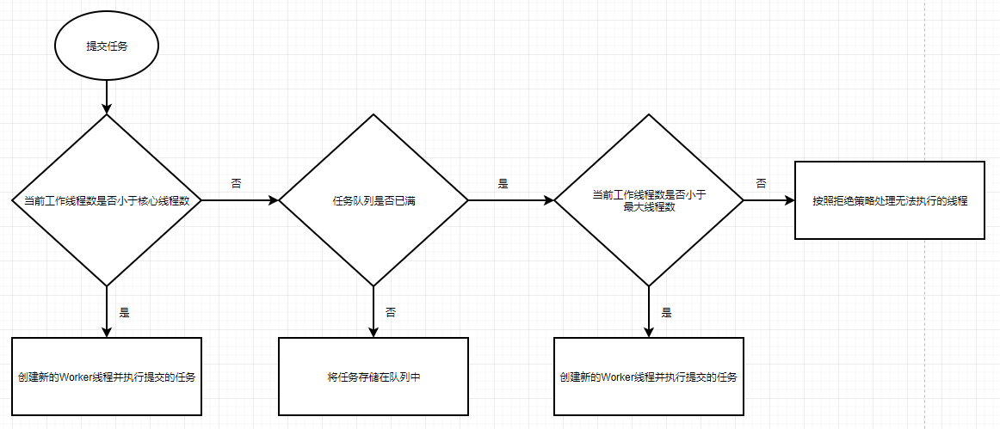
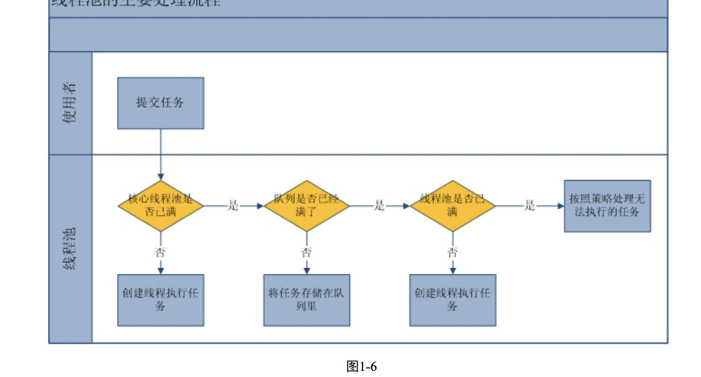
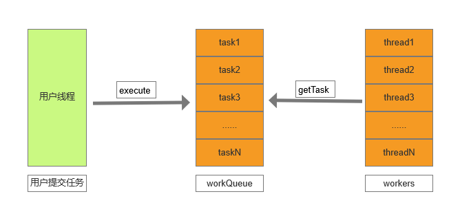

#		ThreadPoolExecutor 源码解析

##	前提基础

想要看明白线程池的源码，先要知道线程几个关键字段的作用及含义，代码如下：

```java
	// 表示线程池的状态和数量
	private final AtomicInteger ctl = new AtomicInteger(ctlOf(RUNNING, 0));
    private static final int COUNT_BITS = Integer.SIZE - 3;
    private static final int CAPACITY   = (1 << COUNT_BITS) - 1;

    // runState is stored in the high-order bits
	// 线程池五个状态
    private static final int RUNNING    = -1 << COUNT_BITS;
    private static final int SHUTDOWN   =  0 << COUNT_BITS;
    private static final int STOP       =  1 << COUNT_BITS;
    private static final int TIDYING    =  2 << COUNT_BITS;
    private static final int TERMINATED =  3 << COUNT_BITS;
```

详细描述自行百度或者参考：

[ThreadPoolExecutor中的ctl变量](https://www.jianshu.com/p/a5a21d48678a)

然后，我们再来看源代码中几个比较重要的方法体

##	构造方法

```java
public ThreadPoolExecutor(int corePoolSize,
                              int maximumPoolSize,
                              long keepAliveTime,
                              TimeUnit unit,
                              BlockingQueue<Runnable> workQueue) {
        this(corePoolSize, maximumPoolSize, keepAliveTime, unit, workQueue,
             Executors.defaultThreadFactory(), defaultHandler);
    }

public ThreadPoolExecutor(int corePoolSize,
                              int maximumPoolSize,
                              long keepAliveTime,
                              TimeUnit unit,
                              BlockingQueue<Runnable> workQueue,
                              ThreadFactory threadFactory) {
        this(corePoolSize, maximumPoolSize, keepAliveTime, unit, workQueue,
             threadFactory, defaultHandler);
    }

public ThreadPoolExecutor(int corePoolSize,
                              int maximumPoolSize,
                              long keepAliveTime,
                              TimeUnit unit,
                              BlockingQueue<Runnable> workQueue,
                              RejectedExecutionHandler handler) {
        this(corePoolSize, maximumPoolSize, keepAliveTime, unit, workQueue,
             Executors.defaultThreadFactory(), handler);
    }

// 最终的构造方法
public ThreadPoolExecutor(int corePoolSize,
                              int maximumPoolSize,
                              long keepAliveTime,
                              TimeUnit unit,
                              BlockingQueue<Runnable> workQueue,
                              ThreadFactory threadFactory,
                              RejectedExecutionHandler handler) {
        if (corePoolSize < 0 ||
            maximumPoolSize <= 0 ||
            maximumPoolSize < corePoolSize ||
            keepAliveTime < 0)
            throw new IllegalArgumentException();
        if (workQueue == null || threadFactory == null || handler == null)
            throw new NullPointerException();
        this.corePoolSize = corePoolSize;
        this.maximumPoolSize = maximumPoolSize;
        this.workQueue = workQueue;
        this.keepAliveTime = unit.toNanos(keepAliveTime);
        this.threadFactory = threadFactory;
        this.handler = handler;
    }
```

其实最终的构造方法都是走到最后一个构造方法中。通过构造方法我们知道线程最基本的几个配置

1. `corePoolSize` 核心线程数
2. `maximumPoolSize` 最大线程数
3. `workQueue` 工作队列（任务队列）,是否会执行拒绝策略
4. `keepAliveTime` 空闲线程的存留时间
5. `threadFactory` 工作线程创建工厂类 ，默认是`Executors.defaultThreadFactory()`
6. `handler` 拒绝策略，默认是`AbortPolicy` ,线程池中自带的拒绝策略有：
   1. `AbortPolicy` 抛弃当前新任务并抛出异常
   2. `DiscardPolicy` 抛弃当前新任务，也不抛异常
   3. `DiscardOldestPolicy` 抛弃目前队列尾部的一个旧任务，重新提交当前新任务
   4. `CallerRunsPolicy` 使用当前线程执行任务


##	提交任务的方法

```java
public void execute(Runnable command) {
        if (command == null)
            throw new NullPointerException();
        /*
         * Proceed in 3 steps:
         *
         * 1. If fewer than corePoolSize threads are running, try to
         * start a new thread with the given command as its first
         * task.  The call to addWorker atomically checks runState and
         * workerCount, and so prevents false alarms that would add
         * threads when it shouldn't, by returning false.
         *
         * 2. If a task can be successfully queued, then we still need
         * to double-check whether we should have added a thread
         * (because existing ones died since last checking) or that
         * the pool shut down since entry into this method. So we
         * recheck state and if necessary roll back the enqueuing if
         * stopped, or start a new thread if there are none.
         *
         * 3. If we cannot queue task, then we try to add a new
         * thread.  If it fails, we know we are shut down or saturated
         * and so reject the task.
         */
        int c = ctl.get();
        if (workerCountOf(c) < corePoolSize) {
            if (addWorker(command, true))
                return;
            c = ctl.get();
        }
        if (isRunning(c) && workQueue.offer(command)) {
            int recheck = ctl.get();
            if (! isRunning(recheck) && remove(command))
                reject(command);
            else if (workerCountOf(recheck) == 0)
                addWorker(null, false);
        } else if (!addWorker(command, false))
            reject(command);
    }

private boolean addWorker(Runnable firstTask, boolean core) {
        retry:
        for (;;) {
            int c = ctl.get();
            int rs = runStateOf(c);

            // Check if queue empty only if necessary.
            if (rs >= SHUTDOWN &&
                ! (rs == SHUTDOWN &&
                   firstTask == null &&
                   ! workQueue.isEmpty()))
                return false;

            for (;;) {
                int wc = workerCountOf(c);
                if (wc >= CAPACITY ||
                    wc >= (core ? corePoolSize : maximumPoolSize))
                    return false;
                if (compareAndIncrementWorkerCount(c))
                    break retry;
                c = ctl.get();  // Re-read ctl
                if (runStateOf(c) != rs)
                    continue retry;
                // else CAS failed due to workerCount change; retry inner loop
            }
        }

        boolean workerStarted = false;
        boolean workerAdded = false;
        Worker w = null;
        try {
            w = new Worker(firstTask);
            final Thread t = w.thread;
            if (t != null) {
                final ReentrantLock mainLock = this.mainLock;
                mainLock.lock();
                try {
                    // Recheck while holding lock.
                    // Back out on ThreadFactory failure or if
                    // shut down before lock acquired.
                    int rs = runStateOf(ctl.get());

                    if (rs < SHUTDOWN ||
                        (rs == SHUTDOWN && firstTask == null)) {
                        if (t.isAlive()) // precheck that t is startable
                            throw new IllegalThreadStateException();
                        workers.add(w);
                        int s = workers.size();
                        if (s > largestPoolSize)
                            largestPoolSize = s;
                        workerAdded = true;
                    }
                } finally {
                    mainLock.unlock();
                }
                if (workerAdded) {
                    t.start();
                    workerStarted = true;
                }
            }
        } finally {
            if (! workerStarted)
                addWorkerFailed(w);
        }
        return workerStarted;
    }
```

`execute` 方法可以说是整个线程池的核心，它表达了整个线程池任务提交的流程如下：



整理一下如下：



第一个判断的代码如下：

```java
	if (workerCountOf(c) < corePoolSize) {
            if (addWorker(command, true))
                return;
            c = ctl.get();
        }
```

`workerCountOf` 方法是获取当前工作线程数

**`addWorker` 方法判断是否可以添加一个`Worker`线程，如果可以就新增一个线程并且start它**

第二个判断的代码如下：

```java
	if (isRunning(c) && workQueue.offer(command)) {
            int recheck = ctl.get();
            if (! isRunning(recheck) && remove(command))
                reject(command);
            else if (workerCountOf(recheck) == 0)
                addWorker(null, false);
        }
```

`isRunning(c)` 判断线程池的状态是否是RUNNING状态

**`workQueue.offer(command)` 向队列中添加任务，如果失败说明队列已满，拒绝添加。可以去查看**`ArrayBlockingQueue` 和`LinkedBlockingQueue`的源码

第三个判断代码如下：

```java
		else if (!addWorker(command, false))
            reject(command);
```

添加工作线程失败说明线程池已满。执行拒绝策略，否则新增工作线程并且执行当前任务

##	Worker类的实现

```java
    private final class Worker extends AbstractQueuedSynchronizer implements Runnable {
        /**
         * This class will never be serialized, but we provide a
         * serialVersionUID to suppress a javac warning.
         */
        private static final long serialVersionUID = 6138294804551838833L;

        /**
         * Thread this worker is running in.  Null if factory fails.
         */
        final Thread thread;
        /**
         * Initial task to run.  Possibly null.
         */
        Runnable firstTask;
        /**
         * Per-thread task counter
         */
        volatile long completedTasks;

        /**
         * Creates with given first task and thread from ThreadFactory.
         *
         * @param firstTask the first task (null if none)
         */
        Worker(Runnable firstTask) {
            setState(-1); // inhibit interrupts until runWorker
            this.firstTask = firstTask;
            this.thread = getThreadFactory().newThread(this);
        }

        /**
         * Delegates main run loop to outer runWorker
         */
        public void run() {
            runWorker(this);
        }

        // Lock methods
        //
        // The value 0 represents the unlocked state.
        // The value 1 represents the locked state.

        protected boolean isHeldExclusively() {
            return getState() != 0;
        }

        protected boolean tryAcquire(int unused) {
            if (compareAndSetState(0, 1)) {
                setExclusiveOwnerThread(Thread.currentThread());
                return true;
            }
            return false;
        }

        protected boolean tryRelease(int unused) {
            setExclusiveOwnerThread(null);
            setState(0);
            return true;
        }

        public void lock() {
            acquire(1);
        }

        public boolean tryLock() {
            return tryAcquire(1);
        }

        public void unlock() {
            release(1);
        }

        public boolean isLocked() {
            return isHeldExclusively();
        }

        void interruptIfStarted() {
            Thread t;
            if (getState() >= 0 && (t = thread) != null && !t.isInterrupted()) {
                try {
                    t.interrupt();
                } catch (SecurityException ignore) {
                }
            }
        }
    }

    final void runWorker(Worker w) {
        Thread wt = Thread.currentThread();
        Runnable task = w.firstTask;
        w.firstTask = null;
        w.unlock(); // allow interrupts
        boolean completedAbruptly = true;
        try {
            while (task != null || (task = getTask()) != null) {
                w.lock();
                // If pool is stopping, ensure thread is interrupted;
                // if not, ensure thread is not interrupted.  This
                // requires a recheck in second case to deal with
                // shutdownNow race while clearing interrupt
                if ((runStateAtLeast(ctl.get(), STOP) ||
                     (Thread.interrupted() &&
                      runStateAtLeast(ctl.get(), STOP))) &&
                    !wt.isInterrupted())
                    wt.interrupt();
                try {
                    beforeExecute(wt, task);
                    Throwable thrown = null;
                    try {
                        task.run();
                    } catch (RuntimeException x) {
                        thrown = x; throw x;
                    } catch (Error x) {
                        thrown = x; throw x;
                    } catch (Throwable x) {
                        thrown = x; throw new Error(x);
                    } finally {
                        afterExecute(task, thrown);
                    }
                } finally {
                    task = null;
                    w.completedTasks++;
                    w.unlock();
                }
            }
            completedAbruptly = false;
        } finally {
            processWorkerExit(w, completedAbruptly);
        }
    }
```

1. `Worker`构造方法初始化`Worker` 的首任务、使用线程工厂对象创建一个线程

2. `run`  方法`Worker`线程启动执行的方法

3. `runWorker`  首先执行的是线程的`firstTask` 任务

4. 在执行`task.run()`的前后分别会执行`ThreadPoolExecutor`的 `beforeExecute(wt, task)`和`afterExecute(task, thrown)` 两个`protected`方法，默认是空实现

5.  **最重要的是：** 这一句`while (task != null || (task = getTask()) != null)`中的`getTask()`

   这个方法是从工作队列`workQueue`中`take`一个任务，如果队列为空则会`await`直到队列中有新的任务

   `offer` 然后`signal`工作线程`workers`。详情去查看阻塞队列的具体实现


##	总结

线程池的实现主要还是根据生产者/消费者模式的实现，主体流程如下：



1. 主体流程就是一个标准的消费者/观察者模式，当队列为空时任务线程`await`在阻塞队列中，有新任务提交再`signal`任务线程
2. 当第一次新建任务线程的时候，任务基本不会提交到工作队列中，而是直接交给任务线程去执行