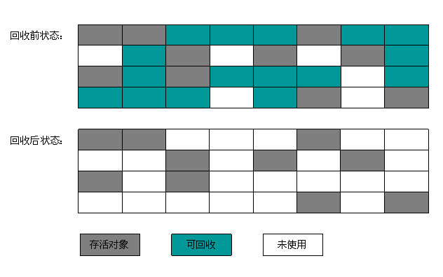
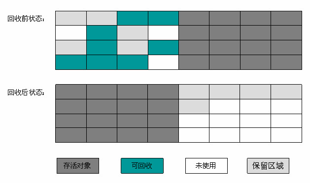
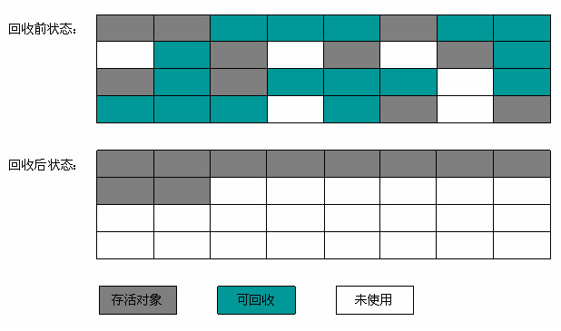

#		垃圾回收算法

垃圾回主要步骤有两步。第一步是：标记，所谓的标记就是判断对象是否应该被回收；第二步是：清除，清除就是将标记该回收的对象占用的内存释放掉。标记涉及的算法主要是引用计数算法和节点可达性算法。清除的算法主要有标记-清除法、复制法、标记-整理算法和分代收集法。

##		判定对象是否死亡的算法

###		引用计数法

引用计数法是这样的：给每个对象添加一个引用计数器，每当对象有一个地方引用它时，计数器+1；当引用失效时，计数器-1；任何时刻，计数器值为0的对象就是可回收的对象。

优点：算法实现简单，判定效率高。

缺点：很难解决互相循环引用问题。

```java
OB a = new OB(); // a +1
OB b = new OB(); // b +1
a.instance = b; // b +1
b.instance = a; // a +1
a = null; // a -1
b = null; // b -1
// 这种情况，a,b对象应该回收的，但是a,b的计数值任然为1,故引用计数法，a,b对象不回收。
```

###		节点可达性算法

节点可达性算法是这样的：通过一系列称为“GC Roots”的对象作为起点，从这些节点开始向下搜索，所搜经过的路径称为引用链，当一个对象到GC Roots没有任何引用链相链接时，则证明该对象是不可用的，该回收的。

优点：解决了互相循环引用的问题。

Java中可作为GC Roots对象包括下面几种：

* 虚拟机栈（栈帧中的本地变量表）中引用的对象。

* 方法区中类静态属性引用的对象。

* 方法区中常量引用的对象

* 本地方法栈中JNI（即Native方法）引用的对象

##  	 垃圾收集算法

###		标记-清除算法

分为标记和清除两个阶段，首先标记出所有需要回收的对象，在标记完成后统一完成回收所有被标记的对象。

有两个缺点：

1. 效率比较低，标记和清除两个过程的效率都不高（都需要遍历整个堆的对象）。
2. 空间问题，标记清除后会产生大量不连续的内存碎片，空间碎片太多了，可能会导致在分配大内存对象时，无法找到足够的连续内存而不得不提前触发额外的一次垃圾收集动作，影响程序运行的效率。



###		复制算法

为了解决效率问题，而出来的一种“复制”的收集算法，它将内存一分为二，每次只使用其中一块内存，当一块内存使用完了，就把需要存活的对象复制到空闲内存中，然后把已使用过这块内存空间一次性清理掉。

优点：实现简单，运行高效。

缺点：内存只能使用一半，代价高。



###		标记-整理算法

复制算法在对象存活率比较高时就需要进行比较多的复制操作，效率也会低下。还有不想浪费空闲的内存空间，老年代就是这种情况。因此有人提出“标记-整理”（Mark-Compact）算法，标记过程与“标记-清除”算法一致，但是后续步骤不是直接对标记的对象进行清理回收，而是让所有存活的对象都往一端移动，然后清理掉端边界以外的内存。



###		分代收集算法

当前商业虚拟机的垃圾收集都采用“分代收集”（Generational Collection）算法，该算法的思路是根据对象存活周期的不同将内存划分为几块。Java一般将堆分为新生代和老年代，这样就可以根据各个年代的特点采用最合适的收集算法。新手代中，每次收集时都有大批量对象死去，只有少量存活，就选用复制算法，只要少量的复制成本就可以完成收集工作。而老年代因为对象存活率高、没有额外的空间对它进行分配担保，就必须使用“标记-清理”或“标记-整理”算法进行回收。