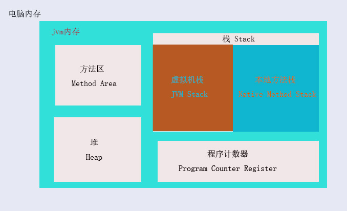

#	第二章	jvm内存区域与内存溢出异常

##		内存划分

认识一种东西肯定是从组成和使用开始。我们在理解jvm的过程也不过如此，jvm的内存组成以及在我们服务器中内存的关系如下图：

提示：*上图还有一个误区是将虚拟机栈和本地方法栈内存强行划分为栈内存区域中，实际情况并不一定是在一起，只是这两块区域性质是一样的，不过是一个是我们代码的栈，一个是java本身运行跑的方法栈而已，本人为了方便记忆便把他们放一起。*

上图只是jvm内存的大致划分，通过上图我们知道jvm运行在我们电脑上，jvm的内存永远小于等于本机电脑的运行内存。这一点在内存溢出的时候，不容忽视的一个点。

**程序计数器：**这是一块非常小的内存区域；线程私有的，所以不存在线程安全问题；用于记录执行字节码指令这基础功能的。该区域不存在内存溢出，所以在一般的工作中都比较忽视它；

**栈(Stack)：**这也是线程私有的，所以不存在线程安全问题；生命周期和线程相同；用于存储局部变量表、操作数栈、动态链接、方法出入口等信息；需要注意的是：虚拟机栈和本地方法栈执行java方法不同，虚拟机栈执行的自定义方法，本地方法栈执行的是Native方法服务。这两个栈，虚拟机规范并没有强制数据结构，所以可能合二为一，也可能不合二为一；

**方法区：**这是各个线程共享的内存区域，主要用于存储已被虚拟机加载的类信息、常量、静态变量、即时编译器编译后的代码等数据。Hotspot虚拟机中也被称为“永久代”（Permanent Generation） ；

运行时常量池：它属于方法区的一部分，用于存储编译时期生成的各种字面量和符号引用；

**堆(Heap):**  这是虚拟机占用最大的一块内存，也是被所有线程共享的一块内存，唯一的目的就是存放对象实例。它还被细分成新生代和老年代。

##		内存溢出异常

首先程序计数器不存在内存溢出，所以根本不用去理会。内存溢出就三个区域，分别是栈、方法区、堆。

**堆溢出**

当对象数量达到堆容量最大限制后就会产生堆内存溢出。可以在启动虚拟机的时候，加上`-XX:+HeapDumpOnOutOfMemoryError`参数，让虚拟机在出现内存溢出的时候Dump出当前的内存堆快照以便事后分析。如果出现堆内存溢出，可以采用一些内存分析工具。分析是否有代码内存溢出，如果所有对象都是该存在的，那就需要调整堆的内存大小，启动时通过参数`-Xms*M -Xmx*M `参数(最好设置成一样，避免堆自动扩展带来的性能消耗)设置堆的内存大小。

**栈溢出**

栈溢出有两种情况：

1. 线程请求的栈深度大于虚拟机所允许的最大深度，将抛出`StackOverflowError`异常;
2. 虚拟机在扩展栈时，无法申请到足够的内存空间，将抛出`OutOfMemoryError`异常.

通过参数`-Xoos`设置本地方法栈大小（如果两个栈合二为一，此参数无效），通过参数`-Xss`设置虚拟机栈容量（合二为一时，只有这一个参数起效）。

***注意：*** *单线程情况下，无论是栈帧太大还是虚拟机栈容量太小，当内存无法分配的时候都是抛出`StackOverflowError`异常；多线程环境下，线程过多也会内存溢出，这与栈容量是否足够大并没有联系，这种情况下应该为每个线程分配的栈内存越小，越不容易出现内存溢出。*

**方法区和运行时常量池溢出**

该区域出现内存溢出紧跟的信息是`PerGen space` 我们可以通过`-XX:PermSize=*M`和`-XX:MaxPermSize=*M`两个参数来限制方法区的大小，以及间接的控制运行时常量池的大小。方法区存储的都是类的基本信息，所以一般都是会启动的时候报溢出异常，运行时基本不报溢出异常，除非应用使用了大量动态代理这种字节码增强和动态语言技术。

**本机直接内存溢出**

直接内存可以通过参数`-XX:MaxDirectMemorySize=*M` 指定，如果不指定，默认跟Java堆最大值一致。如果整个应用所需要的内存比整机内存还大，那只能换设备了。

##		总结

会出现内存溢出的只有三个区域，分别是堆、栈、方法区。我们最关注内存区域就是堆和栈，因此工作中也只会经常提堆栈两个字；虚拟机版本不一样，部分内向区域划分也不一样，所以出现冷门的内存溢出问题，需要考虑一下虚拟机版本，并且查看相应的官方说明。