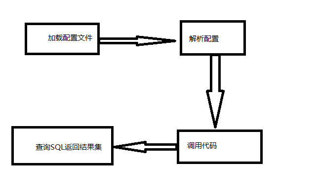

#		MyBatis源码简要分析

##		启动过程源码分析

在分析MyBatis源码之前，先想一下MyBatis的启动过程。过程应该如下图：



这是是我个人自己分析的流程。我们再来观察一下使用MyBatis的步骤，如下：

1. 配置配置文件，SqlSession.xml和Mapper.xml；
2. 编码。

代码如下：

```java
@Test
public void mybatis() throws IOException {
        InputStream stream = Resources.getResourceAsStream("dao/mapper/SqlSessionConfig.xml");
        SqlSessionFactory sessionFactory = new SqlSessionFactoryBuilder( ).build(stream);
        SqlSession sqlSession = sessionFactory.openSession( );
        User user = new User( );
        user.setId(1);
        user.setUsername("zhansan");
        User user1 = sqlSession.selectOne("user.findOne", user);
        System.out.println("user1 = " + user1);
}
```

该代码分析如下表：

| 类名                     | 作用说明                                                     |
| ------------------------ | ------------------------------------------------------------ |
| Resources                | 读取SqlSessionConfig.xml配置文件为二进制流                   |
| SqlSessionFactoryBuilder | 1. 解析SqlSessionConfig.xml配置并封装成Configuration；<br/>2. 根据SqlSessionConfig.xml配置的mappers信息解析mapper信息并封装成MappedStatement保存在Configuration中或者解析对应的mapper类封装成MapperProxyFactory注册进Configuration的MapperRegistry中保存；<br/>3. 初始化DefaultSqlSessionFactory并把封装的Configuration通过构造函数设置进去。 |
| SqlSessionFactory        | 1. 根据环境获取事务管理生产类TransactionFactory并实例化事务对象；<br/>2. 根据事务和执行类型实例化Executor；<br/>3. 实例化DefaultSqlSession，并把相关配置信息和Executor通过构造函数传递进去。 |
| SqlSession               | 1. 根据statementId 执行相关sql操作。                         |

通过上表，我们就大致明白了整个执行过程每一步做了什么东西，接下来我们看看，sql操作具体是怎么执行的。

##		SQL执行过程

