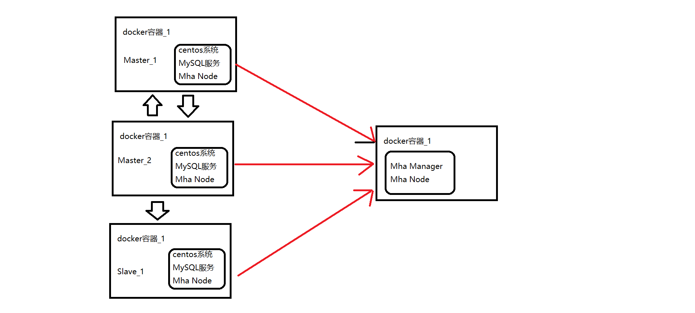

#		Mha、MySQL5.7基于Docker高可用架构部署

##		环境准备

1. 宿主机系统：windows 10。
2. docker 软件(Docker version 19.03.12)。
3. 下载好老师给的数据库包：`mysql-5.7.28-1.el7.x86_64.rpm-bundle.tar`、`mha4mysql-node-0.58-0.el7.centos.noarch.rpm`、`mha4mysql-manager-0.58-0.el7.centos.noarch.rpm`。

##		基础知识前提

1. docker的安装和基本使用，资料参考：[菜鸟教程](https://www.runoob.com/docker)、[docker官网](https://www.docker.com)。
2. Mha的基本使用，资料参考：[Github库](https://github.com/yoshinorim/mha4mysql-manager/wiki/Installation)、[percona指导](https://www.percona.com/blog/2016/09/02/mha-quickstart-guide/)。

##		架构思路

看了一下资料，架构思路如下图：



双主之间互相复制，其中一个主出问题，Mha Node能够监控到，然后执行切换的脚本。


##		软件安装

**1、安装好docker**

windows下docker安装自行百度，新版docker安装非常简单。可以参考官网。

**2、拉取Centos镜像**

因为打算用centos系统做本次作业，所以拉取Centos7的镜像。打开windows命令行工具(`win+R`)，在命令行输入以下命令：

```shell
# 一定要拉取以下镜像，官方centos：7最新版本镜像，其他镜像可能会出问题
# 例如：yum 源未配置，对于新人来说yum源配置，还是比较繁琐的，本人就是新人一个，不会配置yum源
docker pull docker.io/centos:7
```

**特别注意：**

1. 镜像选择，一定要选择`docker.io`下的，其他的镜像本人经过一天的折腾，发现yum源未配置好，需要自己配置yum源。对于新手有压力。

**3、创建docker网络**

命令行执行以下命令：

```shell
docker network create -d bridge mha-net
```

创建的这个网络，是方便docker容器之间互联

**4、创建镜像容器**

创建三个镜像容器，两Master分别在一个容器中，Slave和Mha Manager在同一个镜像容器中。并且将三个容器放在同一个docker网络中，就是刚刚创建的网络。命令如下：

```shell
# 解释一下意思：
# docker run 运行一个容器
# -itd 运行参数，自行百度。-i：交互式操作 -t：终端 -d：容器后台运行
# --name 容器启动后的名字
# -p 本地宿主机端口号与容器端口号映射
# -v 挂载书主机的路径到容器中的文件夹，方便文件传输。注意的是：windows下有分区的概念所以//f指的是F盘
#	 意思就是将F盘中的docker_stat文件夹挂载到容器的/mnt中
# --privileged 参数就是容器内要再运行一个服务，使用systemctl和service命令的话必须设置为true
# --network 就是将容器加入到docker网络中，上面创建的。实现容器之间互联
docker run -itd --name centos_7_1 --network mha-net -p 3406:3306 -p 6479:6379 -v //f/docker_stat:/mnt --privileged=true docker.io/centos:7 /usr/sbin/init
# 第二个容器
docker run -itd --name centos_7_2 --network mha-net -p 3407:3306 -p 6480:6379 -v //f/docker_stat:/mnt --privileged=true docker.io/centos:7 /usr/sbin/init
# 第三个容器
docker run -itd --name centos_7_3 --network mha-net -p 3408:3306 -p 6481:6379 -v //f/docker_stat:/mnt --privileged=true docker.io/centos:7 /usr/sbin/init
```

执行完毕后，执行：`docker ps`。效果如下：

```verilog
CONTAINER ID        IMAGE               COMMAND             CREATED             STATUS              PORTS                                            NAMES
e3cbd5896bd1        centos:7            "/usr/sbin/init"    5 seconds ago       Up 4 seconds        0.0.0.0:3408->3306/tcp, 0.0.0.0:6481->6379/tcp   centos_7_3
5d731ad83438        centos:7            "/usr/sbin/init"    6 minutes ago       Up 6 minutes        0.0.0.0:3407->3306/tcp, 0.0.0.0:6480->6379/tcp   centos_7_2
b99966757723        centos:7            "/usr/sbin/init"    8 minutes ago       Up 8 minutes        0.0.0.0:3406->3306/tcp, 0.0.0.0:6479->6379/tcp   centos_7_1
```

说明容器创建完毕。

**本部分内容需要注意如下：**

1. 需要挂载路径，windows下有分区的概念，目前版本(Docker version 19.03.12)的docker**分区用双斜杠**表示；
2. 因为我们要在容器里面运行mysql服务，**所以privileged参数一定要设置为true**，否则没法启动服务，并且容器一旦创建，没法修改；
3. 别忘了加入同一个docker网络，否则容器之间没法互相连接。

最终设计的容器及MySQL信息如下表：

| 容器名     | 映射宿主机端口号 | 容器网络中的IP及MySQL端口号 | 角色   | Server_id |
| ---------- | ---------------- | --------------------------- | ------ | --------- |
| centos_7_1 | 3406             | 172.18.0.2:3306             | Master | 1         |
| centos_7_2 | 3407             | 172.18.0.3:3306             | Master | 2         |
| centos_7_3 | 3408             | 172.18.0.4:3306             | Slave  | 3         |

**5、进入容器中安装软件**

**5.1、软件准备**

下载老师给软件包，百度网盘下载太慢，可以考虑淘宝一个月会员，下载比较快。下载完成后，将软件包拷贝到F盘的dokcer_stat目录下，因为上面启动容器挂载的该路径。

**5.2、MySQL安装**

1、检查是否自带了MariaDb，镜像一般不带；但是还是检查一下，防止出问题。执行以下命令：

```she
rpm -qa|grep mariadb
```

如果现实有就执行以下命令卸载它

```shell
rpm -e --nodeps mariadb-libs-5.5.60-1.el7_5.x86_64
```

2、安装MySQL软件，按照以下步骤：

```shell
# 到挂载路径/mnt下，此时就有之前拷贝过来的软件安装包了
cd /mnt
# 解压MySQL压缩包
tar -xvf mysql-5.7.28-1.el7.x86_64.rpm-bundle.tar
# 严格照以下顺序安装MySQL包，顺序：common ==> libs ==> client ==> server
rpm -ivh mysql-community-common-5.7.28-1.el7.x86_64.rpm

rpm -ivh mysql-community-libs-5.7.28-1.el7.x86_64.rpm

rpm -ivh mysql-community-client-5.7.28-1.el7.x86_64.rpm
# 安装server的时候，可能会报错，缺少相关依赖包
# 安装相关依赖包，分别安装perl、libaio、libnuma*、net-tools包
yum install -y perl libaio libnuma* net-tools

rpm -ivh mysql-community-server-5.7.28-1.el7.x86_64.rpm

```

**特别注意：第一个容器解压缩之后，另外两个容器就不用解压缩了，因为文件共享了；只有执行安装命令即可。**

3、配置启动MySQL

查看MySQL的状态，执行以下命令：

```shell
# 可能没有service这个命令，安装该命令
# 查看可安装的yum源的版本
yum list | grep initscripts
# 安装软件
yum -y install initscripts
# 查看MySQL服务状态，一般是未启动
service mysqld status
```

出现如下信息说明未启动：

```verilog
 mysqld.service - MySQL Server
   Loaded: loaded (/usr/lib/systemd/system/mysqld.service; enabled; vendor preset: disabled)
   Active: inactive (dead)
     Docs: man:mysqld(8)
           http://dev.mysql.com/doc/refman/en/using-systemd.html
```

**先不要着急启动，先修改配置**；执行以下命令：

```shell
# 密码相关的配置
vi /etc/my.cnf
# 加入以下内容
# 跳过密码验证
skip-grant-tables
# 设置默认字符集UTF-8
character_set_server=utf8
# 设置默认字符集UTF-8
init_connect='SET NAMES utf8'
# 密码模式改为简单
validate_password_policy=0
# 密码长度不低于四位
validate_password_length=4
# 保存退出
shift+z
```

**重要：密码参数设置很重要，不然后面设置密码各种不符合要求，因为本地测试，所以没必要那么安全。**

**如果没有设置密码参数，那么密码不能低于8位，并且大小写和特殊字符组成。**

启动MySQL服务，命令行如下：

```shell
# 启动MySQL服务
systemctl start mysqld.service
# 获取初始密码
cat /var/log/mysqld.log | grep password
```

得到如下信息：

```verilog
2020-08-16T05:01:05.964823Z 1 [Note] A temporary password is generated for root@localhost: ciMf#tw)w9gS
```

**尽管我们设置了跳过密码验证，但是还是获取到密码，以防万一。如果不跳过密码验证安全设置可能特别多限制，可以查看参考文章中1819错误**

执行`msyql -uroot`进入MySQL服务，进行账号初始化，执行以下SQL：

```mysql
-- 修改密码为root
update mysql.user set authentication_string=password('root') where user='root';
-- 刷新权限信息
flush privileges;
-- 授权远程访问
GRANT ALL PRIVILEGES ON *.* TO 'root'@'%' IDENTIFIED BY 'root' WITH GRANT OPTION;
```

退出MySQL服务，修改配置重启MySQL服务

```shell
# 打开配置文件
vi /etc/my.cnf
# 将跳过密码验证注释掉
# skip-grant-tables
# 停止服务
systemctl stop mysqld.service
# 查看状态
service mysqld status
# 启动服务
systemctl start mysqld.service
# 再次确认状态
service mysqld status
```

**重复以上步骤把剩下的两个MySQL也安装完毕**

**5.3、配置MySQL主从复制**

执行`vi /etc/my.cnf `打开MySQL的配置文件，分别添加如下配置：

centos_7_1中配置如下：

```ini
log-bin=mysql-bin 
server-id=1
# 忽略以下库
binlog-ignore-db = information_schema
binlog-ignore-db = performance_schema
binlog-ignore-db = mysql
binlog-ignore-db = sys
```

centos_7_2中配置如下：

```ini
log-bin=mysql-bin 
server-id=2
binlog-ignore-db = information_schema
binlog-ignore-db = performance_schema
binlog-ignore-db = mysql
binlog-ignore-db = sys
```

centos_7_3中配置如下：

```ini
# log-bin=mysql-bin
server-id=3
```

然后依次重启三个服务，命令如下：

```shell
# 关闭服务
systemctl stop mysqld.service
# 启动服务
systemctl start mysqld.service
```

centos_7_1中给从库授权，执行以下SQL:

```mysql
-- 直接执行同步主库可能会报错，需要先改一下密码，版本不同可能不同
alter user 'root'@'localhost' identified by 'root';
flush privileges;
-- 授权复制同步
GRANT REPLICATION SLAVE ON *.* TO 'root'@'%' IDENTIFIED BY 'root';
-- 查看master状态，得到文件信息
show master status \G;
```

**此处授权命令时候，可能会被拒绝，所以再次修改一下密码。下面的从库操作也是。**

得到master状态信息如下：

```verilog
*************************** 1. row ***************************
             File: mysql-bin.000002
         Position: 833
     Binlog_Do_DB:
 Binlog_Ignore_DB: information_schema,performance_schema,mysql,sys
```


centos_7_2中开启复制同步，执行以下SQL:

```mysql
-- 直接执行同步主库可能会报错，需要先改一下密码，版本不同可能不同
alter user 'root'@'localhost' identified by 'root';
flush privileges;
change master to master_host = '172.18.0.2', master_port = 3306, master_user = 'root', master_password = 'root', master_log_file= 'mysql-bin.000002', master_log_pos= 833;
start slave;
show slave status \G;
```

centos_7_3中开启复制同步，执行以下SQL:

```mysql
-- 直接执行同步主库可能会报错，需要先改一下密码，版本不同可能不同
alter user 'root'@'localhost' identified by 'root';
flush privileges;
-- 同步Master,注意单词不要写错了
change master to master_host = '172.18.0.2', master_port = 3306, master_user = 'root', master_password = 'root', master_log_file= 'mysql-bin.000002', master_log_pos= 833;
start slave;
show slave status \G;
```

*提示：可以直接验证一下同步是否故障。*

**5.4、配置MySQL半同步复制**

centos_7_1中，执行以下SQL:

```mysql
-- 安装半同步复制主库的插件
install plugin rpl_semi_sync_master soname 'semisync_master.so';
-- 查看参数
 show variables like '%semi%';
-- 开启半同步复制
set global rpl_semi_sync_master_enabled = 1;
set global rpl_semi_sync_master_timeout = 2000;
-- 确认参数生效
show variables like '%semi%';
-- 安装半同步复制主库的插件，因为宕机了，会变成从
install plugin rpl_semi_sync_slave soname 'semisync_slave.so';
-- 开启
set global rpl_semi_sync_slave_enabled = 1;
-- 确认开启
show variables like '%semi%';
```

退出MySQL服务，将半同步复制的配置加入到配置文件中，执行`vi /etc/my.cnf`打开配置文件，写入配置：

```ini
rpl_semi_sync_master_enabled=1
rpl_semi_sync_master_timeout=2000
rpl_semi_sync_slave_enabled=1
```

centos_7_2中，重复centos_7_1的步骤之后，再执行以下SQL:

```mysql
stop slave io_thread;
start slave io_thread;
```


centos_7_3中，执行以下SQL:

```mysql
-- 安装半同步复制主库的插件,只是从库所以安装一个即可
install plugin rpl_semi_sync_slave soname 'semisync_slave.so';
-- 开启
set global rpl_semi_sync_slave_enabled = 1;
-- 确认开启
show variables like '%semi%';
-- 重新开启同步线程
stop slave io_thread;
start slave io_thread;
```

退出MySQL服务，将半同步复制的配置加入到配置文件中，执行`vi /etc/my.cnf`打开配置文件，写入配置：

```ini
rpl_semi_sync_slave_enabled=1
```

验证是否是半同步复制，在主库centos_7_1中更新或者插入一条记录，查看centos_7_1中的日志，看末尾是否有sem特殊字眼

```shell
 cat /var/log/mysqld.log
```

如下信息：

```verilog
2020-08-16T07:40:39.577630Z 12 [Note] Start semi-sync binlog_dump to slave (server_id: 3), pos(mysql-bin.000002, 2302)
2020-08-16T07:41:18.436923Z 13 [Note] While initializing dump thread for slave with UUID <1fd93058-df82-11ea-87d6-0242ac120003>, found a zombie dump thread with the same UUID. Master is killing the zombie dump thread(3).
2020-08-16T07:41:18.437043Z 13 [Note] Start binlog_dump to master_thread_id(13) slave_server(2), pos(mysql-bin.000002, 2302)
2020-08-16T07:41:18.437065Z 13 [Note] Start semi-sync binlog_dump to slave (server_id: 2), pos(mysql-bin.000002, 2302)
2020-08-16T07:41:18.437049Z 3 [Note] Stop asynchronous binlog_dump to slave (server_id: 2)
```

有关键词**semi-sync**说明已经开启半同步复制

**5.5、安装MHA**

1、三个服务器都安装依赖包

```shell
wget http://dl.fedoraproject.org/pub/epel/epel-release-latest-7.noarch.rpm
rpm -ivh epel-release-latest-7.noarch.rpm

yum install -y perl-DBD-MySQL perl-Config-Tiny perl-Log-Dispatch perl-Parallel-ForkManager
```

发现报了一个错误如下：

```verilog
-> Processing Dependency: libmysqlclient.so.18(libmysqlclient_18)(64bit) for package: perl-DBD-MySQL-4.023-6.el7.x86_64
--> Processing Dependency: libmysqlclient.so.18()(64bit) for package: perl-DBD-MySQL-4.023-6.el7.x86_64
--> Finished Dependency Resolution
Error: Package: perl-DBD-MySQL-4.023-6.el7.x86_64 (base)
           Requires: libmysqlclient.so.18()(64bit)
Error: Package: perl-DBD-MySQL-4.023-6.el7.x86_64 (base)
           Requires: libmysqlclient.so.18(libmysqlclient_18)(64bit)
```

原因是缺少Percona-XtraDB-Cluster-shared-55-5.5.37-25.10.756.el6.x86_64.rpm这个包，执行以下命令安装：

```shell
# 下载安装包
wget http://www.percona.com/redir/downloads/Percona-XtraDB-Cluster/5.5.37-25.10/RPM/rhel6/x86_64/Percona-XtraDB-Cluster-shared-55-5.5.37-25.10.756.el6.x86_64.rpm
# 安装安装包
rpm -hiv  Percona-XtraDB-Cluster-shared-55-5.5.37-25.10.756.el6.x86_64.rpm
# 安装相关依赖
yum -y install libmysql* 
```

再次执行第一步的安装命令，安装依赖：

```shell
yum install -y perl-DBD-MySQL perl-Config-Tiny perl-Log-Dispatch perl-Parallel-ForkManager
```

**特别注意：依赖包必须安装完成，否则安装Mha node的时候会报错，缺失依赖。**

2、三个服务器都生成ssh秘钥对，三个服务器执行以下命令：

```shell
# 可能会出现ssh命令不存在，最小安装的系统没有相应软件，所以安装ssh
# 安装ssh客户端和服务端，因为自己也要被别人连，所以一起安装了
yum install -y openssh-clients openssh-server
# 生成密钥对
ssh-keygen -t rsa -P '' -f ~/.ssh/id_rsa
# 开启ssh服务
systemctl enable sshd
systemctl start sshd
# 修改当前用户密码，因为scp的时候需要密码，修改密码得到新密码
passswd
```

3、互相scp秘钥对

centos_7_1中执行以下命令：

```shell
# 将秘钥对拷贝到当前的id_rsa_1.pub文件中
cat ~/.ssh/id_rsa.pub >> id_rsa_1.pub
# 拷贝上传命令
scp id_rsa_1.pub 172.18.0.3:~/.ssh/id_rsa_1.pub
scp id_rsa_1.pub 172.18.0.4:~/.ssh/id_rsa_1.pub
```

centos_7_2容器中执行以下命令：

```shell
cat ~/.ssh/id_rsa.pub >> id_rsa_2.pub
scp id_rsa_2.pub 172.18.0.2:~/.ssh/id_rsa_2.pub
scp id_rsa_2.pub 172.18.0.4:~/.ssh/id_rsa_2.pub
```

centos_7_3容器中执行以下命令：

```shell
cat ~/.ssh/id_rsa.pub >> id_rsa_3.pub
scp id_rsa_3.pub 172.18.0.2:~/.ssh/id_rsa_3.pub
scp id_rsa_3.pub 172.18.0.3:~/.ssh/id_rsa_3.pub
```

**.开头是隐藏文件，~不能少。**

**注意此时只是把秘钥彼此互传并没有生效，需要把内容拷贝到authorized_keys文件中才会生效。当然你可以使用`ssh-copy-id -i .ssh/id_rsa.pub 用户名字@192.168.x.xxx`命令互相传递也可以。**

centos_7_1中执行以下命令：

```shell
cat id_rsa.pub >> authorized_keys
cat id_rsa_2.pub >> authorized_keys
cat id_rsa_3.pub >> authorized_keys
```

centos_7_2中执行以下命令：

```shell
cat id_rsa.pub >> authorized_keys
cat id_rsa_1.pub >> authorized_keys
cat id_rsa_3.pub >> authorized_keys
```

centos_7_3中执行以下命令：

```shell
cat id_rsa.pub >> authorized_keys
cat id_rsa_1.pub >> authorized_keys
cat id_rsa_2.pub >> authorized_keys
```

**注意：别忘了把自己的秘钥也加入到authorized_keys文件中。**

4、三个服务器都安装Mha node

```shell
# 安装node，注意该软件是刚开始下载的，所以去挂载目录下执行命令即可
rpm -ivh mha4mysql-node-0.58-0.el7.centos.noarch.rpm
```

5、在centos_7_3中安装Mha manager

```shell
rpm -ivh mha4mysql-manager-0.58-0.el7.centos.noarch.rpm
```

可能会缺失依赖，执行以下命令：

```shell
yum install perl-DBD-MySQL perl-Config-Tiny perl-Log-Dispatch perl-Parallel-ForkManager perl-Time-HiRes
```

安装完依赖后再次执行manager安装命令。

**5.6、配置Mha**

**在安装manager的服务器上**随便新建一个文件，添加配置即可，不过linux的习惯一般讲配置文件建在/etc/下面。我新建在/etc/mha/下面。命令如下：

```shell
# 进入etc文件夹
cd /etc/
# 新建文件夹mha
mkdir /mha
cd /mha
touch mha_default.cnf
vi mha_default.cnf
```

填入以下内容：

```ini
[server default]
#mysql user and password
user=root
password=root
ssh_user=root
ping_interval=2
# working directory on the manager
manager_workdir=/opt/mha
# working directory on MySQL servers
remote_workdir=/opt/mha
# manager log dir
manager_log=/var/log/mha/manager.log
[server1]
hostname=172.18.0.2
port=3306
[server2]
hostname=172.18.0.3
port=3306
[server3]
hostname=172.18.0.4
port=3306
```

保存退出。

**5.7、测试Manager服务及启动**

1、检查ssh是否可以免密互联：

```shell
masterha_check_ssh --conf=/etc/mha/mha_default.cnf
```

可能会检测，连接失败。

**检查SSH KEY生成步骤是否齐全**

1. 是否少了`cat`步骤；
2. 检测`~/.ssh/`文件夹是否有`authorized_keys`文件；
3. 别忘记把自己的key加入到`authorized_keys`文件中；
4. 网上有人说，第一次使用免密登录还是需要输入密码，可以在秘钥设置完成后，手动ssh连接一次。

2、检查主从复制是否健康：

```shell
masterha_check_repl --conf=/etc/mha/mha_default.cnf
```

该步骤可能会报错，本人遇到如下错误：

```verilog
libmysqlclient_18 not defined in file libmysqlclient.so.18
```

本人检查了很久，查看网上资料后，检查文件。发现`/usr/lib64/libmysqlclient.so.18`文件是存在的，但是经过一顿折腾之后发现`/usr/lib64/mysql/libmysqlclient.so.18`这个文件不存在，所以开始怀疑应该是mysql安装忘了装什么了，最后发现的确忘了安装对应的包，分别在三台服务器上到`/mnt`目录下执行以下命令:

```shell
rpm -ivh mysql-community-libs-compat-5.7.28-1.el7.x86_64.rpm
```

再次执行主从复制检测命令:

```shell
masterha_check_repl --conf=/etc/mha/mha_default.cnf
```

本人遇到主从一直有问题，可以**尝试一下重置主从**，重启是最好的解题方法，哈哈。在两台从库中执行以下命令

```mysql
# 重置从库
reset slave all;
# 去主库centos_7_1获取新的日志信息
show master status \G;
# 从新配置主从
-- 同步Master,注意单词不要写错了
change master to master_host = '172.18.0.2', master_port = 3306, master_user = 'root', master_password = 'root', master_log_file= '${new_bin_log_flie}', master_log_pos= ${new_position};
```

直到检测主从，健康为止。**可以主库写命令测试一下是否真的有故障**

3、启动mha manager 服务

```shell
nohup masterha_manager --conf=/etc/mha/mha_default.cnf --remove_dead_master_conf --ignore_last_failover /var/log/mha/manager.log 2>&1 &
# 检查一下manager的状态
masterha_check_status --conf=/etc/mha/mha_default.cnf
```

**5.8、测试故障转移**

停掉Centos_7_1的服务，查看日志信息，看到如下信息：

```verilog
Mon Aug 17 13:45:14 2020 - [info] Master failover to 172.18.0.3(172.18.0.3:3306) completed successfully.
Mon Aug 17 13:45:14 2020 - [info] Deleted server1 entry from /etc/mha/mha_default.cnf .
Mon Aug 17 13:45:14 2020 - [info]

----- Failover Report -----

mha_default: MySQL Master failover 172.18.0.2(172.18.0.2:3306) to 172.18.0.3(172.18.0.3:3306) succeeded

Master 172.18.0.2(172.18.0.2:3306) is down!

Check MHA Manager logs at e3cbd5896bd1:/var/log/mha/manager.log for details.

Started automated(non-interactive) failover.
The latest slave 172.18.0.3(172.18.0.3:3306) has all relay logs for recovery.
Selected 172.18.0.3(172.18.0.3:3306) as a new master.
172.18.0.3(172.18.0.3:3306): OK: Applying all logs succeeded.
172.18.0.4(172.18.0.4:3306): This host has the latest relay log events.
Generating relay diff files from the latest slave succeeded.
172.18.0.4(172.18.0.4:3306): OK: Applying all logs succeeded. Slave started, replicating from 172.18.0.3(172.18.0.3:3306)
172.18.0.3(172.18.0.3:3306): Resetting slave info succeeded.
Master failover to 172.18.0.3(172.18.0.3:3306) completed successfully.
```

说明自动主从切换成功

**5.9、故障转移后续**

故障之后，Mha manager会把对应的节点信息给去掉；所以故障机后面想加入节点的话，**记得把节点的信息再次加入到Mha manager 配置文件中**

否则会manger会报如下错误：

```verilog
[warning] Global configuration file /etc/masterha_default.cnf not found. Skipping.
Mon Aug 17 15:42:35 2020 - [info] Reading application default configuration from /etc/mha/mha_default.cnf..
Mon Aug 17 15:42:35 2020 - [info] Reading server configuration from /etc/mha/mha_default.cnf..
Mon Aug 17 15:42:35 2020 - [info] MHA::MasterMonitor version 0.58.
Mon Aug 17 15:42:36 2020 - [error][/usr/share/perl5/vendor_perl/MHA/ServerManager.pm, ln671] Master 172.18.0.2:3306 from which slave 172.18.0.4(172.18.0.4:3306) replicates is not defined in the configuration file!
Mon Aug 17 15:42:36 2020 - [error][/usr/share/perl5/vendor_perl/MHA/MasterMonitor.pm, ln427] Error happened on checking configurations.  at /usr/share/perl5/vendor_perl/MHA/MasterMonitor.pm line 329.
Mon Aug 17 15:42:36 2020 - [error][/usr/share/perl5/vendor_perl/MHA/MasterMonitor.pm, ln525] Error happened on monitoring servers.
Mon Aug 17 15:42:36 2020 - [info] Got exit code 1 (Not master dead).
```

*注意第一行警告部分*


**文章参考：**

1. [[在docker下搭建MySQL MHA集群](https://www.jianshu.com/p/d00d17797855)]: https://www.jianshu.com/p/d00d17797855
2. [[[MySQL高可用架构之基于MHA的搭建](https://www.cnblogs.com/panwenbin-logs/p/8306906.html)]:https://www.cnblogs.com/panwenbin-logs/p/8306906.html
3. [[centos7安装mysql5.7（rpm安装版）](https://www.cnblogs.com/helf/p/11244711.html)]:https://www.cnblogs.com/helf/p/11244711.html
4. [[centos7安装mysql（完整）](https://www.cnblogs.com/lzhdonald/p/12511998.html)]:https://www.cnblogs.com/lzhdonald/p/12511998.html
5. [[CentOS 7下使用rpm包安装mysql 5.7.18](https://www.jb51.net/article/118848.htm)]:https://www.jb51.net/article/118848.htm
6. [ [centos7service命令不可用](https://blog.csdn.net/qq_35440040/article/details/77966623)]:https://blog.csdn.net/qq_35440040/article/details/77966623
7. [[libaio.so.1()(64bit) is needed by MySQL-server 问题解决办法](https://blog.csdn.net/huangchao064/article/details/79348765/)]:https://blog.csdn.net/huangchao064/article/details/79348765/
8. [[libnuma.so.1()(64bit) is needed by mysql-community-server](https://blog.csdn.net/cm333666/article/details/100227804)]:https://blog.csdn.net/cm333666/article/details/100227804
9. [[centos没有service命令的恢复方法](https://www.cnblogs.com/duguxiaobiao/p/9465686.html)]:https://www.cnblogs.com/duguxiaobiao/p/9465686.html
10. [[Docker容器使用问题：Failed to get D-Bus connection: Operation not permitted](https://blog.csdn.net/zhenliang8/article/details/78330658)]:https://blog.csdn.net/zhenliang8/article/details/78330658
11. [[mysql错误详解（1819）：ERROR 1819 (HY000): Your password does not satisfy the current policy requirements](https://blog.csdn.net/ssiyla/article/details/82931439)]:https://blog.csdn.net/ssiyla/article/details/82931439
12. [[Requires: libmysqlclient.so.18()(64bit)](https://blog.csdn.net/jiaping0424/article/details/94661361)]:https://blog.csdn.net/jiaping0424/article/details/94661361
13. [[centos7安装mha4mysql](https://blog.csdn.net/weixin_34095889/article/details/92855107)]:https://blog.csdn.net/weixin_34095889/article/details/92855107
14. [[ssh-copy-id三步实现SSH无密码登录和ssh常用命令](https://blog.csdn.net/liu_qingbo/article/details/78383892)]:https://blog.csdn.net/liu_qingbo/article/details/78383892
15. [[Linux安装php-mysql提示需要：libmysqlclient.so.18()(64bit)的解决办法](https://blog.csdn.net/ckg8933/article/details/83379279)]:https://blog.csdn.net/ckg8933/article/details/83379279

