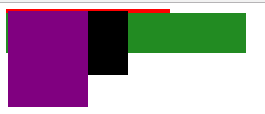
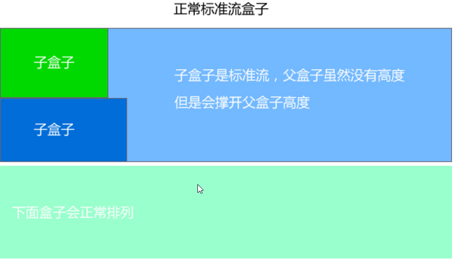
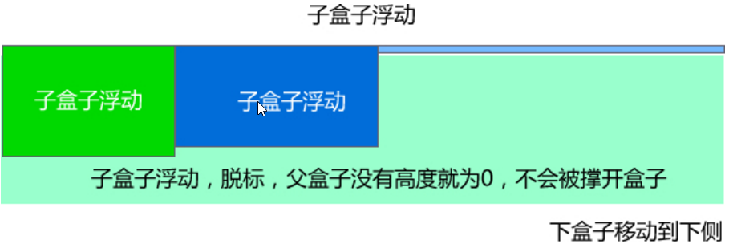

#   <center>CSS学习笔记</center>
##  行高
一个标签(盒子)的高度由三部分组成：上距离、内容高度和下距离
##  css样式的三大特性
-   **重叠性**

指的是流浪器处理冲突的能力，相同优先级的条件下，同一个属性被多次设置到一个元素上，这个时候一个属性会将里一个属性重叠掉

**重叠遵循就近原则：** 下面的重叠掉上去的，也就是距离结构越近的重叠掉远的

**口诀：** 长江后浪推前浪，前浪死在沙滩上
-   **继承性**

子标签会继承父标签的<font style = "color:red">**某些**</font>样式,example:文本颜色和字号

**总结：** 子承父业，一般是文本相关的一些样式
-   **优先级**
不同的css选择器有不同的优先级别，具体规范如下：

优先级用一个四位数的数 字串(css@2是三位)来表示，像四个级别，值从左往右，左面的最大，一级大于一级，数位之间没有进制，一别之间不可超越。

| 描述 | 权重值 |
| ---------------- |:---------:|
|**继承或者*的贡献值**|**0,0,0,0**|
|每个元素(标签选择器)贡献值|0,0,0,1|
|每个类，伪类(类选择器)贡献值|0,0,1,0|
|每个ID(ID选择器)贡献值|0,1,0,0|
|每个内行样式贡献值|1,0,0,0|
|每个!important贡献值|∞ 无穷大|

*tips：* 位数之间不存在进位，就是说最后一位最后相互累加超过10(0,0,0,10)时，不会变成0,0,1,0，而是依然是0,0,0,10
例如：
```css
div ul li             -------------> 0,0,0,3
.nav ul li            -------------> 0,0,1,2
a:hover               -------------> 0,0,1,1(a标签的悬停伪类选择)
.nav a                -------------> 0,0,1,1
#nav div              -------------> 0,1,0,1
div ul li a ..15个... -------------> 0,0,0,15(而不是0,0,1,5)
```

```css

```
##  浮动(float)
浮动的作用是让标签逃离标准流控制从而使多个块标签在同一行显示，相对于行内块标签的优势是相邻标签之间可以无缝衔接

使用方式：`选择器{float:属性值;}`

| 属性值 | 描述 |
| ------------- |:-------------:|
| left | 元素向左浮动 |
| right | 元素向右浮动 |
| none | 不浮动(默认值) |
***
**浮动内幕特性**

1.  脱离标准流，不占位置从而影响<font style = "color:red;font-weight:bold">**后面**</font>标准流；表现：浮动下方标准流块标签会重叠在浮动标签下层
    ，但是浮动标签上面或前面的标准流块标签不影响
2.  浮动只有左右浮动，不会上下浮动(上下只会重叠)；
3.  浮动不会越过父标签的内边距(padding)；表现：只会在父标签的内边距内部左右浮动
4.  浮动具有隐藏的显示模式转换，加了浮动元素具有行内块元素的特性(但不是行内块元素)，元素的大小完全取决于定义的大小或者内容的大小
***

##  清除浮动
本质不是清楚浮动本身，是清除浮动的影响。

-  **为什么要清除浮动**
    1.  有时候父盒子不方便给高度，比如：文章需要浮动的时候。
    2.  如果子盒子之间是浮动，但是父盒子又没有指定高度的时候，父盒子则会你没有高度，那么父盒子下面的盒子就会顶上去和浮动的子盒子重合
    ```css
    <!DOCTYPE html>
    <html lang="en">
    <head>
        <meta charset="UTF-8">
        <title>浮动问题</title>
        <style>
            .father {
                width: 200px;
                border: 2px solid red;
            }

            .big {
                width: 100px;
                height: 120px;
                background-color: purple;
                float: left;
            }

            .small {
                width: 50px;
                height: 80px;
                background-color: black;
                float: left;
            }
            .bottom {
                width: 300px;
                height: 50px;
                background-color:forestgreen;
            }
        </style>
    </head>
    <body>
    <div class="father">
        <div class="big"></div>
        <div class="small"></div>
    </div>
    <div class="bottom"></div>
    </body>
    </html>
    ```
    效果如下：

    

    以上问题的原因是：在标准流中，盒子是占位置，所以big和small盒子会把father盒子撑开，但是子盒子浮动了就不占位置，因此father盒子就不会撑开，就是默认的大小

    

    
-   **清除浮动的本质**

清除浮动主要是为了解决父级元素因为子级浮动又不方便固定高度而引起内部高度为0的问题

-   **清除浮动的方法**

其本质叫做闭合浮动，清除浮动就是浮动的盒子圈到里面，让父盒子闭合出口和入口不让他们出来影响其他元素。
clear属性用于清除浮动，其用法如下：

选择器`{clear:属性值;}`

| 属性值 | 描述 |
| ------------- |:-------------:|
| left | 不允许左侧有浮动元素(清除左侧浮动的影响) |
| right | 不允许右侧有浮动元素(清除右侧浮动的影响)|
| both | 同时清除左右侧浮动的影响 |

1.  **额外标签法**

通过最末尾的浮动元素添加一个空的标签，例如`<div style = "clear:both"></div>`,或者其他标签即可

**优点：** 通俗易懂，书写方便
**缺点：** 添加许多无意义的标签，结构化差。

2.  **父级添加overflow属性方法**

可以通过触发**BFC**的方式实现浮动

```
可以给父级标签添加：overfload为 hidden | auto | sroll 都可以实现
```
**优点：** 代码简洁

**缺点：** 内容增多时候容易造成不会自动换行导致内容被隐藏掉，无法显示需要溢出的元素。

3.  **使用after伪元素**

:after 方式为空元素的升级版，好处是不用单独添加标签了

使用方法(为了兼容性，全写上)：
```
.clearfix:after {content: "";display:block;height:0;clear:both;visibility:hidden;}
.clearfix{*zoom:1;} /*IE6、7 专有*/
```
**优点：** 符合闭合浮动思想 结构语义化正确

**缺点：** 由于IE6-7不支持:after，使用zoom:1触发hasLayout。

代表网站：百度、淘宝网、网易等

4.  **双伪元素清除浮动**

使用before和after双伪元素清除浮动

使用方法：
```
.clearfix:before,.clearfix:after {
    content:"";
    display:table; /* 这句话可以触发BFC BFC可以清除浮动*/
}
.clearfix:after {
    clear:both;
}
.clearfix {
    *zoom:1; /*IE6-7专用，前面带*告诉IE7以下浏览器解析，其他浏览器不解析*/
}
```
**优点：** 代码更简洁

**缺点：** 由于IE6-7不支持:after，使用zoom:1触发hasLayout。
