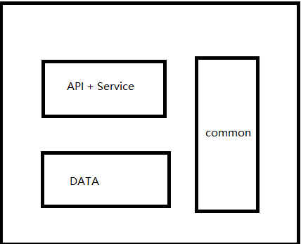

#		关于Model层的一次设计

**背景：**最近在做一个新项目，服务端一个人承担；也是第一次，一个人承担服务端并且从0开始做的项目。整个项目因为处于demo阶段，所以是个单体项目。项目技术栈：spring boot 全家桶 + mybatis-plus。为了快也懒得写文档。文档生成用的是：swagger-bootstrap-ui 框架。整个项目的架构如下图：

**过程中的感受：**在写响应前端的Model和接收VO的时候，发现和DATA层的POJO老是在重复写代码，拷贝对象字段。

##		第一次设计

为每个API接口写一个Model。

优点：生成的文档清晰明了，互相之间独立。

缺点：重复编写大量的set和get代码，对象之间频繁复制。

为了解决缺点就想了第二种设计。

##		第二次设计

直接用Model去继承POJO，POJO的对象用mybatis-plus逆向生成工具生成能得到带SWG注解的类。

**优点：**速度快，代码也写的少。

**缺点：**生成的文档很不清晰，每个接口都有一堆没返回给前端的字段；业务中的额外字段会污染PO；POJO承担的责任太重了，Model、VO、PO都一个承担了。

**解决方法：**

缺点1的解决的方法是可以忽略掉不返回前端的字段（SWG的使用），但是还是有情况，就是接口之间主体对象是PO但是很多部分字段又不是PO中的，比如列表信息和详情信息，有交叉。所以生成的文档还是会不清晰，特别是遇上前端代码洁癖那就的挨批斗了。

缺点2的解决办法是在继承的Model中定义额外附属字段，列表简要的用户头像昵称信息等。

##	第三次设计

Model 建立Model的继承关系，VO建立自己的继承关系，不跟Po继承。意思就是：列表中简要信息的Model 为这个业务的BaseModel，详情接口的Model 去继承BaseModel；详情中独有的字段在详情Model中定义。

**优点：** 生成的文档已经相当清晰了，只有一个两个字段会发送交叉的情况；重复编写的代码也相比第一次少了比较多。

**缺点：**BaseModel的set方法复用也比较麻烦，因为BaseModel不能直接转换为子Model。

并且暂时没想到好的解决方法。

##		总结

通过这次发现，项目的架构真的是非设计的，而是跟着业务走出来的。关于Model、VO、PO的重复编写字段和set、get方法问题还是没有非常满意，希望有更好建议的朋友给与评论。谢谢！