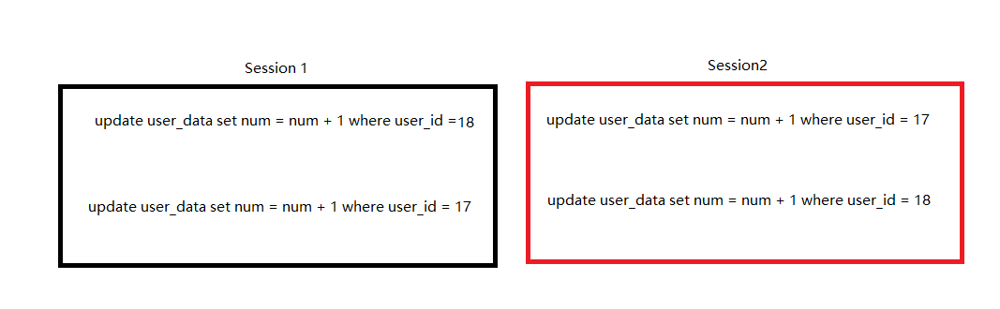

# 一次被自己蠢到的数据库死锁经历

先说这次事件的背景故事，一个创业项目，需要冷启动。该项目类似于微博的一个项目，所以冷启动需要导入一批微博数据和微博评论数据，导入数据还需要在马甲账号加上统计数据，因为可以查看他人中心，不然太假。就在更新马甲账号统计数据的时候老是发生死锁。

技术背景，我开一个接口给爬虫工程师上传约定的标准json文件，由于考虑数据可能会比较多，所以用了一个线程池去插入数据，线程池大小16。伪代码如下：

1. Service类：
  ```java
  List<D> dataList = Json.toObj(json);
  dataList.forEach(
      v->{
        threadPoolTaskExecutor.execute(() -> {
                        dataVHandler.handler(v);
                });  
      }
  )
  ```

2. Handler类：

   ```java
   @Transactional
   void method(data){
       weiboRepository.save(data);
   	List<C> commentList = data.getCommentList();
       commentList.forEach(c->{
           commentRepository.save(c);
           roleDataRepository.update(c.getUserId(), numData);
       })
       roleDataRepository.update(data.getUserId(), numData);
   }
   
   ```

1.  UserDataRepository类：

```java
@Transactional
void update(userId, numData){
   D userData = selectByUserId(userId);
    if(null == userData){
        // 初始化且合并数据
        merge(userData,numData);
        save(userData);
    }
    // 合并数据
    merge(userData,numData);
    update(userData);
}
```

一开始，总看在后面这个小事物中，后来想想，userId未加索引，select 会扫描全表，但是select也没有加上加锁关键字，也不应该啊，为了效率和防止出错，给userId加上了索引，还有我数据事物隔离级别是读提交，没有间隙锁，行锁也不应该死锁啊。结果当然是依旧死锁。

各种分析，使用数据库命令，查看死锁结果，死锁结果都是锁记录锁（行锁，这也说明不是间隙锁），并且是两个记录之间互相等待死锁，想了很久都没想明白为什么。

于是问别人，其他人也不知道为啥，但是得到了新的思路，有人提出了，可能更新连接不够，Mybaits框架也会出现问题，报锁等待超时异常。结果测试增加连接池，依据死锁。

总想啊，到晚上睡觉前都没找到原因，第二天到公司，继续找原因，于是我一直导入同个数据，发现总是卡在某个数据，肯定是导入的时候文件中那行数据有问题，于是拿出来分析一下，瞬间脑子清醒了。为啥呢？因为两条记录的userId顺序互相交叉了，一条微博下面有个评论列表，评论列表也有马甲账号id。然后再查一下Spring的事物传播特性，默认是合并事物，所以上面代码的事物是在handler的事物中执行，handler的事物更新了多个UserData，然后并发事物交叉更新，就死锁了。最后在UserDataRepository类另起一个事物，最后测试一下，没有死锁OK了。修改后代码如下：

```java
@Transactional(propagation = Propagation.REQUIRES_NEW)
void update(userId, numData){
   D userData = selectByUserId(userId);
    if(null == userData){
        // 初始化且合并数据
        merge(userData,numData);
        save(userData);
    }
    // 合并数据
    merge(userData,numData);
    update(userData);
}
```

死锁原因(普通的交叉)：



##		总结

在一个事物中多次更新同一个表的时候，一定要特别注意，因为多次更新同一个表，就可能会出现交叉的情况，就会发生死锁。


[参考]: https://www.cnblogs.com/micrari/p/8831834.html	"GC Ergonomics间接引发的锁等待超时问题排查分析"
[参考]: https://www.jianshu.com/p/606de826a203	"记spring事务传播机制引发连接池死锁问题及解决方案"
[参考]: https://cloud.tencent.com/developer/article/1058715	"Mybatis-update - 数据库死锁 - 获取数据库连接池等待"

