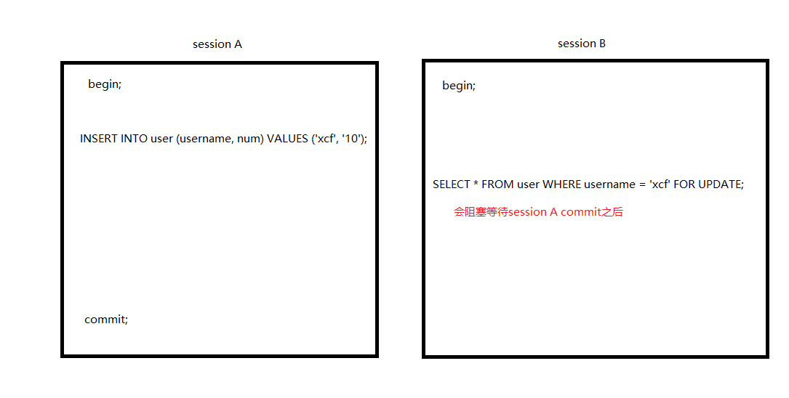

#		插入唯一数据的各种问题

上篇文章中解决了死锁问题，但是新问题出现，我发现user_data表中有重复的user_id记录。原因分析不言而喻，并发插入引起。上次代码：

```java
@Transactional(propagation = Propagation.REQUIRES_NEW)
public void update(userId, numData){
   D userData = selectByUserId(userId);
    if(null == userData){
        // 初始化且合并数据
        merge(userData,numData);
        save(userData);
    }
    // 合并数据
    merge(userData,numData);
    update(userData);
}
```

当两个请求同时到达update方法的时候，都发现不存在，在没有唯一索引的情况下，就会同时插入两条一模一样user_id的数据。说一下解决问题的过程，很曲折。在说解决问题过程中，交代一个背景就是我们系统还是单服，不用考虑分布式并发问题的解决方案，数据库的隔离级别是读提交(READ-COMMITTED)。

##		简单啊，并发问题而已，方法加上关键字synchronized

有人肯定会说整个方法加锁，并发度低的问题，暂时我们不去考虑这个问题，因为这段代码执行操作不多，速度很快。加上关键字synchronized后，代码如下：

```java
@Transactional(propagation = Propagation.REQUIRES_NEW)
public synchronized void update(userId, numData){
   D userData = selectByUserId(userId);
    if(null == userData){
        // 初始化且合并数据
        merge(userData,numData);
        save(userData);
    }
    // 合并数据
    merge(userData,numData);
    update(userData);
}
```

当时的自己是如此的潇洒自如啊，洋洋自得。然后测试一下，第一次没问题，第二次，一首凉凉送给自己。为什么？一样出现重复数据，这是为什么呢?因为自己对Spring事物的理解不透彻。后来百度一下，查到原因了。

**原因：Spring的事物是基于动态代理AOP实现的，所以锁会在事物提交之前释放。**

想想，如果事物没有提交，但是锁释放了，就会有第二个线程的select还是不存在，所以插入重复的user_id数据记录了。那怎么办呢？后来终于找到了一个方法（神坑方法）

##		注册Spring事物的生命回调

方法就是：注册Spring的事物的生命回调，使用`ReentrantLock`，在回调里unlock；两个类：`TransactionSynchronizationManager` 和 `TransactionSynchronizationAdapter`不知道怎么使用，自行百度，改完之后代码如下：

```java
private final Lock lock = new ReentrantLock( );
@Transactional(propagation = Propagation.REQUIRES_NEW, isolation = Isolation.READ_COMMITTED)
    public void update(Long userId, UserRoleData data) {
        // 方法1
        UserData userData = selectByUserId(userId);
        if (null == userData) {
            lock.lock( );
            TransactionSynchronizationManager.registerSynchronization(new TransactionSynchronizationAdapter( ) {
                @Override
                public void afterCompletion(int status) {
                    try {
                        super.afterCompletion(status);
                    } finally {
                        lock.unlock( );
                    }
                }
            });
            // 方法2
            userData = selectByUserId(userId);
            if (null == userData) {
                // 初始化且合并数据
        		merge(userData,numData);
        		save(userData);
                return;
            }
        }
        // 合并数据
    	merge(userData,numData);
    	update(userData);
    }
```

以上代码，我想了一下，锁整个方法，并发性低，其实大部分情况都是更新，插入情况很少，这不禁让我想起来单例模式的双重锁检查的写法，于是改成上述上代码。

再说一下，我此时根据百度的认识，`TransactionSynchronizationAdapter`中的方法，各个方法的使用时机，认识如下：

1. afterCommit 在事物提交之后被调用；
2. afterCompletion 在事物完成之后会被调用。

先说一下结局吧，结局就是并发执行，还是会有重复user_id的记录。瞬间泪奔了，我也在此处卡了很久。因为从目前的认识来说，不应该存在这种情况。我们分析一下，为啥不会啊？

1. 第一个线程判断不存在数据所以会在进入第二个判断之前，lock住代码，在事物完成之后unlock；
2. 就算有一个线程进入了第一次判空里，在上一个线程释放锁后，进入lock块，第二次查询肯定是存在数据的（因为事物读提交，所以上个线程提交之后，这里是可以查询到数据的），因此不会进入，而是走到最后进行更新。

但是为啥结局不是这样的呢？我瞬间没有了放向，问了很多人，很多人也一时间不知道什么原因，反正各种说法。

说法如下：

1. Spring的事物传播特性是REQUIRES_NEW的时候，会有危险的事情发生；大部分都是讲另起事物，将上个事物挂起，所以可能发生锁等待事情；子事物发生异常不会让父事物回滚。这么多好像跟我这个没关系。
2. 还有就是事物隔离级别确定有没有错，结果我反复确认，没有错（就是读提交，代码和数据库都标记上）。
3. 竟然有人说`ReentrantLock`有问题，它的实现是阻塞对列。
4. 还有人说我写的狗屎代码，好吧，我狗屎了，我只是想知道原理而已，并且解决问题。

反正说法各一，于是我就把实际的代码改写成一个demo并且在各个要点打上日志，不停的各种调试。改写的代码如下：

```java
    private final Lock lock = new ReentrantLock();

    @Transactional(propagation = Propagation.REQUIRES_NEW, isolation = Isolation.READ_COMMITTED)
    public void update(User user) {
        // 根据username查询用户，username普通索引
        User top = userMapper.findTopByUsername(user);
        if (null == top) {
            System.out.println("Lock 之前 = " + Thread.currentThread().getName());
            lock.lock();
            System.out.println("Lock 进入 = " + Thread.currentThread().getName());
            TransactionSynchronizationManager.registerSynchronization(new TransactionSynchronizationAdapter() {
                @Override
                public void afterCompletion(int status) {
                    super.afterCompletion(status);
                    System.out.println("==== afterCompletion = " + Thread.currentThread().getName());
                    lock.unlock();
                }
            });
            top = userMapper.findTopByUsername(user);
            System.out.println("second top = " + top);
            if (null == top) {
                top = new User();
                top.setUsername(user.getUsername())
                        .setNum(user.getNum())
                ;
                userMapper.save(top);
                return;
            }
        }
        userMapper.update(user);
    }
```


**日志的现象是：并发进入第一个判断里的时候的线程会等待在前一个线程的锁释放后才继续执行，但是第二个查询依然查询不到值。白话就是：查询不到已提交事务的结果。还有一个就是并发进入第一个空判断的线程似乎必然查询不到前一个线程save的记录**

结果跟现象一致，多少个线程并发进入了第一个空判断，数据库就有多少条相同username的记录。

根据现象发生的可能就是只有两种：一个是执行afterCompletion方法的时候，事务并没有提交；还有一个就是事务的隔离级别不对。

针对第一个猜想，同特意翻了一下Spring事务相关的源码，这里简要说一下源码吧，类调用如下：
`TransactionInterceptor#invoke` ==========> `TransactionAspectSupport#invokeWithinTransaction` ==========> `AbstractPlatformTransactionManager`

大致的调用流程，这过程我发现，很多框架都是继承AbstractPlatformTransactionManager实现自己定制的一些事务管理。

最终在找到提交事务的方法`AbstractPlatformTransactionManager#commit`，代码如下：

```java
@Override
	public final void commit(TransactionStatus status) throws TransactionException {
		if (status.isCompleted()) {
			throw new IllegalTransactionStateException(
					"Transaction is already completed - do not call commit or rollback more than once per transaction");
		}

		DefaultTransactionStatus defStatus = (DefaultTransactionStatus) status;
		if (defStatus.isLocalRollbackOnly()) {
			if (defStatus.isDebug()) {
				logger.debug("Transactional code has requested rollback");
			}
			processRollback(defStatus, false);
			return;
		}

		if (!shouldCommitOnGlobalRollbackOnly() && defStatus.isGlobalRollbackOnly()) {
			if (defStatus.isDebug()) {
				logger.debug("Global transaction is marked as rollback-only but transactional code requested commit");
			}
			processRollback(defStatus, true);
			return;
		}

		processCommit(defStatus);
	}

private void processCommit(DefaultTransactionStatus status) throws TransactionException {
		try {
			boolean beforeCompletionInvoked = false;

			try {
				boolean unexpectedRollback = false;
				prepareForCommit(status);
				triggerBeforeCommit(status);
				triggerBeforeCompletion(status);
				beforeCompletionInvoked = true;

				if (status.hasSavepoint()) {
					if (status.isDebug()) {
						logger.debug("Releasing transaction savepoint");
					}
					unexpectedRollback = status.isGlobalRollbackOnly();
					status.releaseHeldSavepoint();
				}
				else if (status.isNewTransaction()) {
					if (status.isDebug()) {
						logger.debug("Initiating transaction commit");
					}
					unexpectedRollback = status.isGlobalRollbackOnly();
                    //TODO 提交事务
					doCommit(status);
				}
				else if (isFailEarlyOnGlobalRollbackOnly()) {
					unexpectedRollback = status.isGlobalRollbackOnly();
				}

				// Throw UnexpectedRollbackException if we have a global rollback-only
				// marker but still didn't get a corresponding exception from commit.
				if (unexpectedRollback) {
					throw new UnexpectedRollbackException(
							"Transaction silently rolled back because it has been marked as rollback-only");
				}
			}
			catch (UnexpectedRollbackException ex) {
				// can only be caused by doCommit
				triggerAfterCompletion(status, TransactionSynchronization.STATUS_ROLLED_BACK);
				throw ex;
			}
			catch (TransactionException ex) {
				// can only be caused by doCommit
				if (isRollbackOnCommitFailure()) {
					doRollbackOnCommitException(status, ex);
				}
				else {
					triggerAfterCompletion(status, TransactionSynchronization.STATUS_UNKNOWN);
				}
				throw ex;
			}
			catch (RuntimeException | Error ex) {
				if (!beforeCompletionInvoked) {
					triggerBeforeCompletion(status);
				}
				doRollbackOnCommitException(status, ex);
				throw ex;
			}

			// Trigger afterCommit callbacks, with an exception thrown there
			// propagated to callers but the transaction still considered as committed.
			try {
                //TODO 执行afterCommit方法
				triggerAfterCommit(status);
			}
			finally {
                //TODO 这里就是调用事务回调的afterCompletion方法
				triggerAfterCompletion(status, TransactionSynchronization.STATUS_COMMITTED);
			}

		}
		finally {
			cleanupAfterCompletion(status);
		}
	}

private void triggerAfterCompletion(DefaultTransactionStatus status, int completionStatus) {
		if (status.isNewSynchronization()) {
			List<TransactionSynchronization> synchronizations = TransactionSynchronizationManager.getSynchronizations();
			TransactionSynchronizationManager.clearSynchronization();
			if (!status.hasTransaction() || status.isNewTransaction()) {
				if (status.isDebug()) {
					logger.trace("Triggering afterCompletion synchronization");
				}
				// No transaction or new transaction for the current scope ->
				// invoke the afterCompletion callbacks immediately
                //TODO 执行回调列表
				invokeAfterCompletion(synchronizations, completionStatus);
			}
			else if (!synchronizations.isEmpty()) {
				// Existing transaction that we participate in, controlled outside
				// of the scope of this Spring transaction manager -> try to register
				// an afterCompletion callback with the existing (JTA) transaction.
				registerAfterCompletionWithExistingTransaction(status.getTransaction(), synchronizations);
			}
		}
	}
```

**看整个源码发现：那个回调方法的确是在代码调用了doCommit之后调用的，并且是回调生命周期中最后执行的方法。**

到此我就觉得很诡异了，并且我怀疑过这个注册的回调方法的时机，我还特意问了很多人包括查资料，都说保证事务提交才会调用，当然从源码看也是这样的。如果是这样，那上面出问题就是第二个，就是事务的隔离级别的问题，但是各种校验，**事务隔离级别是读提交**啊，简直是见鬼了。后来我怀疑是不是框架某个配置的原因，导致中间修改了隔离级别，我做了一个实验，那就是代码里挂起一个事务，去数据查询当前的事务信息。结果查询当前正在执行的**事务是读提交**，结果如下：


到此，我开始怀疑人生了，我心中顿时一万只草泥马奔腾而过，问别人，别人也不知道原因。只是说了一下解决唯一的方法，其实解决唯一的方法很简单，只要加上唯一索引就好了，然后在代码的异常中处理更新。但是我就要想知道原理。

后来睡了一觉，脑子清醒了一点，发现是因为读不到数据，那就把第二个查询改成当前读(**因为这样除了串行化事务隔离级别，其他都能读到**)试试。代码如下：

```java
    @Transactional(propagation = Propagation.REQUIRES_NEW, isolation = Isolation.READ_COMMITTED)
    public void update(User user) {
        // 根据username查询用户，username普通索引
        // SQL: select * from user where username = #{username} limit 1
        User top = userMapper.findTopByUsername(user);
        if (null == top) {
            System.out.println("Lock 之前 = " + Thread.currentThread().getName());
            lock.lock();
            System.out.println("Lock 进入 = " + Thread.currentThread().getName());
            TransactionSynchronizationManager.registerSynchronization(new TransactionSynchronizationAdapter() {
                @Override
                public void afterCompletion(int status) {
                    super.afterCompletion(status);
                    System.out.println("==== afterCompletion = " + Thread.currentThread().getName());
                    lock.unlock();
                }
            });
            // SQL: select * from user where username = #{username} limit 1 for update
            top = userMapper.findCCTopByUsername(user);
            System.out.println("second top = " + top);
            if (null == top) {
                top = new User();
                top.setUsername(user.getUsername())
                        .setNum(user.getNum())
                ;
                userMapper.save(top);
                return;
            }
        }
        userMapper.update(user);
    }
```

这次结果完整无误，果然只有一条username的记录了。此时的我还是一脸蒙蔽，不知道为啥这样就没问题了，此时我有个疑惑，for update 在读提交是怎么加锁的呢？在此时，我知道在**可重复读级别**下：数据记录存在的时候会加行锁和间隙锁，当然如果索引是唯一索引会退化成行锁；在数据记录不存的时候，会对整个表加上间隙锁，所以就会出现网上都说的发生死锁的情况。但是**读提交事务隔离级别**是没有间隙锁的，只有行锁和mdl锁，于是我在客户端模拟了一下，发现for update 在记录存在的时候加的是行锁，只会和相关记录冲突。比如：当前事务正在更新或者插入一条id为1 的记录，for update就会阻塞等待，否则不会阻塞等待。

情况如下：

但是如果之前没有username为xcf，for update 比插入先执行的话，插入和for update是不会阻塞对方的。

到此时就明白为啥上面代码没问题了，**原因分析如下：如果一个线程执行插入的时候，即使事务没有提交，其他并发线程select for update 上一个相同的username时，会阻塞等待上个线程执行commit, 上个线程commit了，此时查询的select for update是不为null的就不会执行插入，而是执行更新操作**

最后，为啥Spring注册回调那种方法没有用，后来也翻源码，找到一些蛛丝马迹，在注册实例类`TransactionSynchronization`中，代码如下：

```java
/**
	 * Invoked after transaction commit/rollback.
	 * Can perform resource cleanup <i>after</i> transaction completion.
	 * <p><b>NOTE:</b> The transaction will have been committed or rolled back already,
	 * but the transactional resources might still be active and accessible. As a
	 * consequence, any data access code triggered at this point will still "participate"
	 * in the original transaction, allowing to perform some cleanup (with no commit
	 * following anymore!), unless it explicitly declares that it needs to run in a
	 * separate transaction. Hence: <b>Use {@code PROPAGATION_REQUIRES_NEW}
	 * for any transactional operation that is called from here.</b>
	 * @param status completion status according to the {@code STATUS_*} constants
	 * @throws RuntimeException in case of errors; will be <b>logged but not propagated</b>
	 * (note: do not throw TransactionException subclasses here!)
	 * @see #STATUS_COMMITTED
	 * @see #STATUS_ROLLED_BACK
	 * @see #STATUS_UNKNOWN
	 * @see #beforeCompletion
	 */
	default void afterCompletion(int status) {
	}
```

看注释，描述一下大致意思：在事务提交或回滚之前执行，可以使用它进行事务完成的资源清理工作，接下来重点来了，提示：事务已经提交或者回滚，但是事务资源可能仍然是激活状态并且可使用的，结果就是此时触发的任何数据访问代码仍将“参与”在原始事务中，允许执行清理工作（无需继续跟踪提交），除非声明在单独的事务中，使用PROPAGATION_REQUIRES_NEW对于这里调用的任何事务。

它的意思是不是这里做清理工作，我们的save和update也要单独另起一个事务。我想了一下，如果这样做，应该是可行的，我们把save另起一个事务试试，代码如下：

```java
@Transactional(propagation = Propagation.REQUIRES_NEW, isolation = Isolation.READ_COMMITTED)
    public void update(User user) {
        // 根据username查询用户，username普通索引
        // SQL: select * from user where username = #{username} limit 1
        User top = userMapper.findTopByUsername(user);
        if (null == top) {
            System.out.println("Lock 之前 = " + Thread.currentThread().getName());
            lock.lock();
            System.out.println("Lock 进入 = " + Thread.currentThread().getName());
            TransactionSynchronizationManager.registerSynchronization(new TransactionSynchronizationAdapter() {
                @Override
                public void afterCompletion(int status) {
                    super.afterCompletion(status);
                    System.out.println("==== afterCompletion = " + Thread.currentThread().getName());
                    lock.unlock();
                }
            });
            top = userMapper.findTopByUsername(user);
            System.out.println("second top = " + top);
            if (null == top) {
                top = new User();
                top.setUsername(user.getUsername())
                        .setNum(user.getNum())
                ;
                userMapper.save(top);
                return;
            }
        }
        userMapper.update(user);
    }


    @Transactional(propagation = Propagation.REQUIRES_NEW, isolation = Isolation.READ_COMMITTED)
    @Insert("INSERT INTO `user` (`username`, `num`) VALUES (#{username}, #{num})")
    void save(User user);
```

**结果发现并没有用，顿时觉得这个事务回调不知道具体什么情况，感觉afterCompletion方法调用是在代码commit之后执行，但是此时数据库中事务有没有commit不知道，希望有牛人解答一下(其实不是Spring的锅，请看后续内容，该段误人子弟了)**。

##		Sharding JDBC 读写分离的插曲

我在demo中代码已经没有问题了，于是移植到我项目中，发现一个现象，事务没法提交，一开始我以为是死锁，异常是锁等待超时，总分析，不可能死锁啊。后来还好我注意到了，查询数据死锁记录是不会发生变化的，说明不是死锁。就是纯粹的死锁等待。于是分析，不应该事务会阻塞啊，这都是微操作，又没有资源竞争导致，事务等待。于是把多线程执行这段代码改成单线程执行了一下，结果也是提交不了事务，显示select for update 等待上一个事务的锁。

把for update 去掉试了一下，没问题，事务正常提交，说明这事情肯定跟锁相关。

于是我分析了一下，会不会数据库锁和代码的锁发生死锁，打日志，分析加锁过程。可以保证的是for update和insert是不会发生死锁的，因为事务的隔离级别是读提交，没有间隙锁的概念。简化加锁过程如下：CLock ====> DBLock =========> unClock ========> unDBLock，不存在交叉获取锁的情况。说明这个方向是错误的。

于是就觉得是不是框架的坑，就像上面的Spring事务的回调一样（demo是mybatis，项目是mybatis-plus），于是百度了一下，还真找到相关资料，说的是：**mybatis是数据源设置为自动提交时，不会帮我们提交事务，druid默认值就是true设置。**我刚好用的就是druid，于是立马改了一下配置，结果一样的依然提交不了事务。

过了一段时间，偶然百度看到一个字眼，读写分离事务也要分离，瞬间发现新大陆了。我用的是Sharding JDBC 读走的从数据库数据源，写走的是主数据库数据源，由于开发。所以我把两个数据配置配成一样了。于是立马把事务分离了，立马可以正常提交事务了。代码如下：

```java
    @Transactional(propagation = Propagation.REQUIRES_NEW, isolation = Isolation.READ_COMMITTED)
    public void update(User user) {
        // 根据username查询用户，username普通索引
        // SQL: select * from user where username = #{username} limit 1
        User top = userMapper.findTopByUsername(user);
        if (null == top) {
            System.out.println("Lock 之前 = " + Thread.currentThread().getName());
            lock.lock();
            System.out.println("Lock 进入 = " + Thread.currentThread().getName());
            TransactionSynchronizationManager.registerSynchronization(new TransactionSynchronizationAdapter() {
                @Override
                public void afterCompletion(int status) {
                    super.afterCompletion(status);
                    System.out.println("==== afterCompletion = " + Thread.currentThread().getName());
                    lock.unlock();
                }
            });
            // SQL: select * from user where username = #{username} limit 1 for update
            //TODO 另起一个事务去执行。
            top = userMapper.findCCTopByUsername(user);
            System.out.println("second top = " + top);
            if (null == top) {
                top = new User();
                top.setUsername(user.getUsername())
                        .setNum(user.getNum())
                ;
                userMapper.save(top);
                return;
            }
        }
        userMapper.update(user);
    }
```

**读写分离：事务记得也要分离，不然可能会出现莫名其妙的坑。**

##		代码优化

看到上面代码，发现在回调里解锁，事务也是没提交，于是去掉了Spring的事务回调代码，代码如下：

```java
@Transactional(propagation = Propagation.REQUIRES_NEW, isolation = Isolation.READ_COMMITTED)
    public void update(User user) {
        // 根据username查询用户，username普通索引
        // SQL: select * from user where username = #{username} limit 1
        User top = userMapper.findTopByUsername(user);
        if (null == top) {
            synchronized (lock) {
                top = userMapper.findCCTopByUsername(user);
                System.out.println("second top = " + top);
                if (null == top) {
                    top = new User();
                    top.setUsername(user.getUsername())
                            .setNum(user.getNum())
                    ;
                    userMapper.save(top);
                    return;
                }
            }
        }
        userMapper.update(user);
    }
```

后来又想了一下，反正第二个for update查询会阻塞是不是可以整加锁都可以去掉呢，代码如下：

```java
    @Transactional(propagation = Propagation.REQUIRES_NEW, isolation = Isolation.READ_COMMITTED)
    public void update(User user) {
        // 根据username查询用户，username普通索引
        // select * from user where username = #{username} limit 1 for update
        User top = userMapper.findCCTopByUsername(user);
        if (null == top) {
            top = new User();
            top.setUsername(user.getUsername())
                    .setNum(user.getNum())
            ;
            userMapper.save(top);
        } else {
            userMapper.update(user);
        }
    }
```

其实仔细分析不行，为啥？

**原因：多个线程并发进入select for update的时候，没有事务在执行插入，所以他们不会互相阻塞，同时得到null值，就会执行下面的插入操作，自然就是多条一样的username记录存在。像之前在第二次for update之前进行lock，因为单服，所以其他线程会阻塞，而代码的锁释放时机是执行插入操作之后，然后后面线程进入第二次查询的时候，因为有相同的username正在插入，数据库会让它锁等待，直到插入完成之后释放**

##	总结

解决问题，方案可能很多，但是个人觉得遇到问题，应该去弄懂问题的原理。就像这次经历，解决问题的过程很曲折，虽然已经有备用方案了，但是还是坚持下来了。

##		后续

这件事情，又经过了几天，有朋友讨论mybatis的一级缓存，突然脑洞，想起来了。这里开启了事务，所以会使用到Mybatis的一级缓存（在Spring中只有开启事务才会使用到一级缓存）。想到一个Mybatis会不会对for update 更新做特殊操作，不走缓存。后来验证果然如此，这时就一切都能解释的通了。详情见我文章[Mybatis一级缓存的坑](https://gitee.com/cfacebook/Summary-Notes/blob/master/%E5%B7%A5%E4%BD%9C%E8%AE%B0%E5%BD%95/Mybatis%E4%B8%80%E7%BA%A7%E7%BC%93%E5%AD%98%E7%9A%84%E5%9D%91.md)


[参考]: https://blog.csdn.net/qq_39660796/article/details/88820514	"springboot 开启事务以及手动提交事务"
[参考]: https://blog.csdn.net/acingdreamer/article/details/91873745	"Spring中@Transactional的使用及事务源码分析"
[参考]: https://segmentfault.com/a/1190000022051705	"select for update不交由spring事务管理的正确姿势"
[参考]: https://blog.csdn.net/heroguo007/article/details/78400040	"并发insert情况下会发生重复的数据插入问题"
[参考]: https://blog.csdn.net/gpf951101/article/details/77751025/	"Spring中声明式事务的注解@Transactional的参数的总结（REQUIRED和REQUIRES_NEW的与主方法的回滚问题）"
[参考]: https://www.ibm.com/developerworks/cn/java/j-ts1.html	"了解事务陷阱"
[参考]: https://blog.csdn.net/maqingbin8888/article/details/81772025	"TransactionSynchronizationManager绑定一个事物并且在事物提交之后操作"
[参考]: https://segmentfault.com/a/1190000004235193?utm_source=tag-newest	"如何在数据库事务提交成功后进行异步操作"


