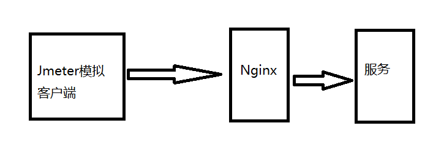

#		压力测试TPS上不去，但是系统资源又很清闲

##		背景

项目需要进行阶段性压力测试，所以想模拟真实的正式环境，所以是直接使用域名访问进行压力。整个请求链路大概如下：



##		现象

就是Jmeter压力测试的结果的TPS很低，基本在200TPS甚至100TPS以下，但是机器的配置非常高（32C + 64G）。当时第一次遇到这种现象很懵逼，没办法，第一次一个人从0做一个系统，压力测试。第一次遇到的现象是直接上不去TPS，空接口也上不去；第二次遇到是TPS能瞬间上去很高，但是立马掉下来，稳不住，但是空接口没问题，可以继续稳住。

##		第一次遇到的排查过程

想了很久都没有找到原因，只能本地跑起来代码，看看情况；当时的思路有两个，一个是代码太烂了，第二个是配置不对导致的。第一个原因的解决方法：找到一个工具去监控代码的卡点；第一个原因的解决方法：不停的改变配置，重新压测看结果，配置包括：Tomcat的配置和代码线程池的配置，有人可能会说，为啥没有考虑JVM的配置，原因是压测测试只压测一个接口的情况并且数据是同一份，JVM不太可能会是瓶颈，当然如果该接口存在很多成员变量缓存除外。

###		代码卡点

在当时找工具中找到`JProfier`，结果发现代码的确存在卡点，但是并没有Jmeter反馈的那么慢，并且最后定位的卡点是Redis的客户端取缓存的地方会比较慢，有可能会出现取一个Key需要几十毫秒的情况。解决的方法自然第一个想到使用Pipeline解决，之前循环取Key变成批量取Key。

老代码的伪代码如下：

```java
// 取主列表数据
Page<News> selectPage = newsRepository.page(query);
Page<NewsModel> convert = selectPage.convert(v->{
    // 循环从缓存取周边数据
    // 取作者信息
   User author = userCache.get(v.getAuthorId());
   ...
   return NewsModle.build(v,author,...);
});
```

新伪代码如下：

```java
// 取主列表数据
Page<News> selectPage = newsRepository.page(query);
Set<ID> authorIds = new HashSet();
Set<ID> newsIds = new HashSet();
selectPage.getRecords().foreach(v->{
    authorIds.add(v.getAuthorId());
    newsIds.add(v.getId());
});
// 分别批量取出周边数据
// 批量取出作者列表并且转换成Map
Map<ID,User> userMap = userCache.getBatchUsers(authorIds);
...
Page<NewsModel> convert = selectPage.convert(v->{
    // 循环从缓存取周边数据
   User author = userMap.get(v.getAuthorId());
   ...
   return NewsModle.build(v,author,...);
});
```

最后压测结果：利用Pipeline并没有很明显的改善。

后来用getKeys命令，发现的确有很明显的提升，所以后来批量取Key操作全部换成getKeys命令。其实后来发现这样做是有很多弊端的，包括Pipeline。

弊端就是在Redis集群环境下就没法这样了，需要改动很多代码。后来据我了解，getKeys命令尽量少做，因为现在的应用基本后面都会走向集群化的。并且Redis的性能很高，网络也基本是内网环境，所以RRT时间影响并不会很大，循环取Key也不会相差很大的。如果真的遇到热Key应该用其他方案解决。

因为本人那时候是单机环境所以就没动了，还是使用了getKeys命令。到此业务的卡点基本解决了。但是TPS提升并不会非常大，有数量级的上升。依旧是不正常的情况。

###		配置调整

配置也各种尝试都没有什么很大变化，所以说明跟配置，大家也是知道的，配置只有给的不会太小的情况，基本影响不是很大。

###		仔细回顾

空接口也会出现同样的问题，说明代码影响不是很大，所以至此遇到问题不要忙于去操作，应该先去分析问题，当时太年轻，一顿操作猛如虎，最后结果两百五。这个现象至少说明是代码的Controller层之前有问题，之前有问题肯定就是拦截器的代码有问题，或者SpringMVC框架和Tomcat有问题；后两者使用的都是稳定版，大概率不应该会出现这种BUG。那就是拦截器代码有问题了，当时为了调试方便有一个AOP会打印所有日志的请求和响应日志。也有人提出会不会是卡在IO上，但是我当时认为代码没有直接IO操作忽略掉了日志的IO操作，于是我关闭日志试试，发现TPS瞬间上去了。心中一万个草泥马，日志框架竟然不会异步去打印日志，而是同步打印日志。到此问题得到解决。当时使用的是Logback日志，普通的配置是不会异步打印，需要额外套一层配置异步打印，各位看官如果使用的也是Logback日志，也需要注意这点。异步配置，各位可以百度一下。

##		第二次遇到排查过程

这次的现象很不一样，这次是会上去，但是会掉下来，造成一种达到系统瓶颈的现象，但是系统资源却没有满的情况。并且空接口并不会造成这种现象。当时的想法是系统已经到了瓶颈，但是系统分析有不对，为什么呢？因为我用**Arthas**工具分析到Controller的方法耗时是会出现耗时超过1s+的情况，但是并不会出现Jmeter的数据显示，接口响应中位数到达几十秒的情况，我一度怀疑Jmeter有BUG，但是找了很久也没有人分享有这个问题。后来项目组招了几个大佬过来，我请求他的援助，他也是分析了两三天，最后没有找到原因，但是他的经验也是这个压测数据肯定有问题。但是此时的我，在他的分析过程中，学到了不少之前没有的经验。所以视野也更宽阔。所以后来我再次接手，我发现一个规律就是Controller的方法用Arthas工具分析不会卡，但是Tomcat的access日志也显示接口耗时严重，跟Jmeter的数据是一致的。于是我跟大佬反馈了这个现象。大佬瞬间跟我一起用Arthas再次监控看系统情况，系统一切正常：网络、IO、JVM；但是看线程情况，发现数据不正常，发现大量的线程在阻塞状态，于是选其中几个线程抽看一下，线程阻塞在哪里，发现阻塞在同一个地方。那就是还是在一个拦截器中，都会对同一个数据进行加锁操作。

###		业务背景及解决方法

需要统计用户的在线时长，这是运营很正常的需求。正常业务的做法是：

1. 用户打开APP，客户端调用登录接口，服务端记录一个登录时间；
2. 用户退出APP，客户端调用退出接口，服务端记录退出时间并且得到这次的在线时长数据，记录上报日志。

但是实际情况是：现在的用户退出应用都是直接杀进程，客户端没法得到这种情况事件，也就是没法调用退出接口了。还有就是用户不会每次都需要登录，所以进入APP也不一定会调用登录接口。所以设计的方案是使用心态机制，用户登录和退出都是服务端控制。做法如下：

1. 服务在Redis在有个记录在线用户Hash，key是用户id，value是用户最近一次访问接口的时间戳；
2. 用户如果访问接口就会更新Hash的数据，如果不存在Hash中没有这个用户，说明是登录事件，记录用户的最近登录时间；
3. 服务端有一个异步定时线程，定时检测Hash，如果Hash中有人的接口访问时间太久了，超过设定的阈值就认为该用户下线了，也就是退出APP了，然后从Hash中移除该用户，并且记录退出时间并且计算得到在线时长数据，记录上报日志。

因为是集群部署，所以这存在线程安全，就采用了锁机制。使用Redis的分布式锁，每次用户请求接口就会调用如下方法，伪代码如下：

```java
// redis分布式锁
private final RedisLock redisLock;
// Redis客户端
private final RedisClient redisClient;
// Redis在线用户Key
privat final String ONLINE_KEY = "UOT_KEY";

private void checkLogin(ID userId){
   	Lock lock = redisLock.obtainLock(ONLINE_KEY);
    boolean isLogin = false;
    try{
        // 大家都阻塞在这里
        lock.lock();
        if(redisClient.hExist(ONLINE_KEY,userId)){
            isLogin = true;
        }
        redisClient.hPut(ONLINE_KEY,userId,Systetm.cunrrentTime());
    } finally {
        lock.unLock();
    }
    if(isLogin){
        // do some thing
        ....
    }
}
```

原因到此时找到了，接下来就改代码了，最后商量的方案，是采用无锁方案，加锁一整段代码使用Redis的lua脚本去做。因为Redis是单线程的，所以使用脚本是不存在线程安全问题。然后再次压力测试，**单机TPS从之前的100直接上升到3000**。

**经历这一次我再一次认识了对多线程编程的知识，在高并发环境中，锁竞争导致上下文切换是可能会非常影响性能的。**

##		结论

系统瓶颈问题，需要从多方面去考量，遇到瓶颈问题不要遗漏任何一处代码。

1. 从系统层面考量，比如系统参数，内存、CPU分配、网络，IO，带宽；
2. 有瓶颈不一定是业务层代码，也有可能是上游拦截器和AOP的代码，不要遗漏任何一处代码；
3. 遇到问题一定要看日志，日志能说明问题的根本原因；
4. Java的层面分析问题，不一定是虚拟机的内存问题，还有可能是线程问题；
5. 系统并不是所有操作都是消耗CPU的，有很多场景是不消耗CPU的，比如：阻塞、本地IO和网络IO；
6. 一定要多了解一些监控工具的使用。

最后，本次回顾因为本人偷懒，所以可能整个事件复盘不是很清晰，各位看官多多包涵。
